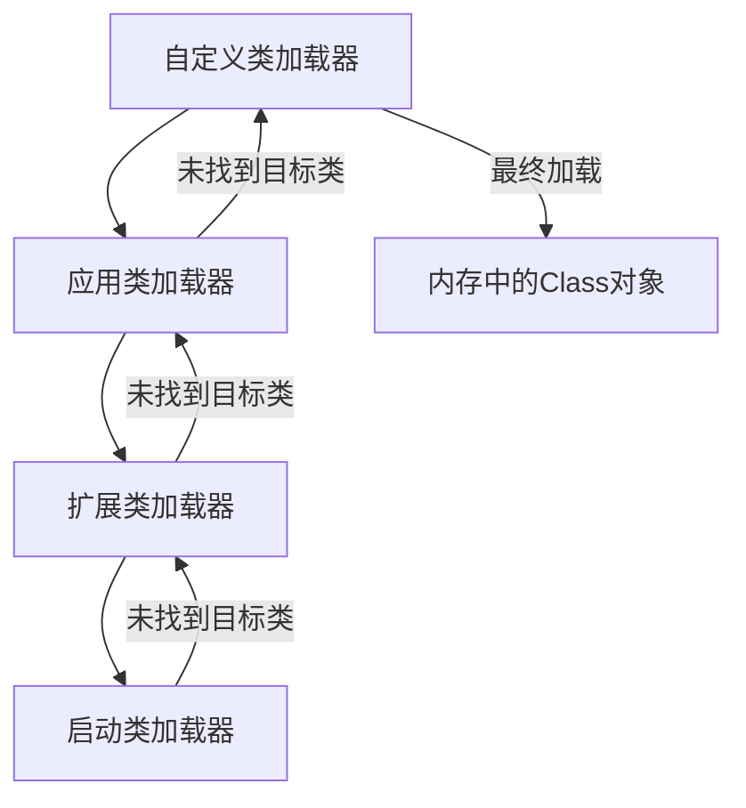
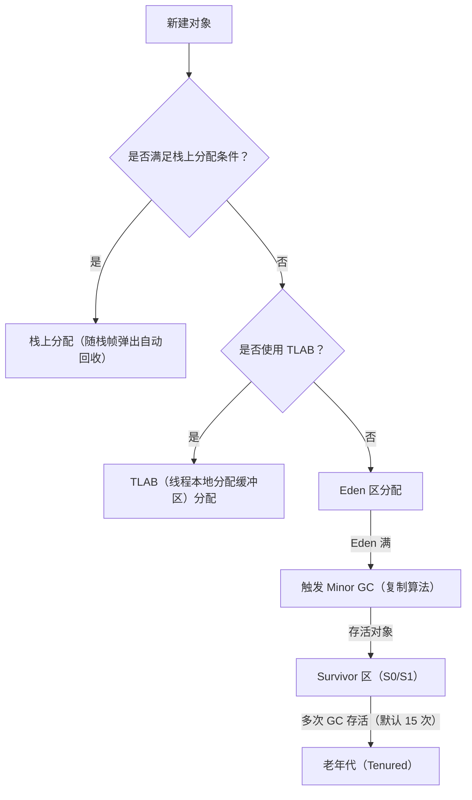

# JVM 核心面试知识点笔记  


## 一、类加载机制与类加载器  


### 1. 类加载的生命周期  
类从被加载到内存到卸载的完整过程分为 **加载→连接→初始化→使用→卸载** 5 个阶段，其中连接阶段包含验证、准备、解析三个子阶段。  


#### （1）关键阶段详解  
| 阶段       | 核心任务                                                                 | 示例说明                                                                 |  
|------------|--------------------------------------------------------------------------|--------------------------------------------------------------------------|  
| **加载**    | 通过类加载器将 `.class` 字节码文件加载到内存，生成 `Class` 对象          | 读取 JAR 包中的 `User.class` 文件，创建 `User` 类的 `Class` 对象           |  
| **验证**    | 校验字节码格式合法性（如魔数 `0xCAFEBABE`）、语义正确性（如 final 类无子类）| JVM 检查 `User.class` 的版本号是否兼容当前 JVM（如 JDK 1.8 无法加载 JDK 11 编译的类）|  
| **准备**    | 为类静态变量分配内存并设置初始值（基本类型默认 0，对象默认 null）          | `static int age = 20` 在准备阶段分配内存，初始值为 0（初始化阶段才赋值 20）|  
| **解析**    | 将符号引用（如 `UserService` 类名）替换为直接引用（内存地址）             | 把 `UserService` 的符号引用替换为指向其 `Class` 对象的指针               |  
| **初始化**  | 执行类构造器 `<clinit>()`（静态变量赋值 + 静态代码块执行）                | 执行 `static { System.out.println("init"); }` 静态代码块                 |  


### 2. 类加载器与双亲委派机制  


#### （1）类加载器层次结构  
JVM 内置 4 层类加载器，从顶层到底层依次为：  

| 类加载器            | 加载范围                                                                 | 实现语言       |  
|---------------------|--------------------------------------------------------------------------|----------------|  
| **启动类加载器（Bootstrap CL）** | 加载 JDK 核心类（如 `java.lang.*`、`rt.jar`、`charsets.jar`）             | C++（JVM 内置）|  
| **扩展类加载器（Extension CL）** | 加载 `jre/lib/ext` 目录下的 JAR（如 `javax.crypto`、`dnsns.jar`）         | Java           |  
| **应用类加载器（Application CL）**| 加载用户类路径（`classpath`）下的类（如项目 `target/classes` 中的类）     | Java           |  
| **自定义类加载器（Custom CL）**   | 加载特定路径或加密的 `.class` 文件（如从数据库/网络加载类）              | Java           |  


#### （2）双亲委派机制（流程图）  


**核心逻辑**：  
- 类加载时，当前类加载器先委托父类加载器尝试加载（递归向上）；  
- 父类加载器无法加载时（如不在其加载范围内），当前类加载器才尝试自己加载；  
- 保证核心类（如 `java.lang.Object`）仅被启动类加载器加载一次，避免篡改和重复加载。  


#### （3）打破双亲委派的场景与示例  
**场景**：  
- 热部署（如 Tomcat 需为不同 Web 应用加载同名不同版本的类）；  
- 模块化（如 OSGi 支持动态替换类）；  
- 自定义加密类（需解密 `.class` 文件后加载）。  

**自定义类加载器示例**（加载加密的 `.class` 文件）：  
```java
import java.io.*;

public class EncryptClassLoader extends ClassLoader {
    private String classPath;
    private byte key = (byte) 0xAB; // 加密密钥

    public EncryptClassLoader(String classPath) {
        this.classPath = classPath;
    }

    @Override
    protected Class<?> findClass(String className) throws ClassNotFoundException {
        try {
            byte[] encryptedData = loadEncryptedClassData(className);
            byte[] decryptedData = decrypt(encryptedData); // 解密字节码
            return defineClass(className, decryptedData, 0, decryptedData.length);
        } catch (IOException e) {
            throw new ClassNotFoundException("Class not found: " + className, e);
        }
    }

    private byte[] loadEncryptedClassData(String className) throws IOException {
        String path = classPath + "/" + className.replace('.', '/') + ".class";
        try (InputStream is = new FileInputStream(path);
             ByteArrayOutputStream baos = new ByteArrayOutputStream()) {
            int len;
            byte[] buffer = new byte[1024];
            while ((len = is.read(buffer)) != -1) {
                baos.write(buffer, 0, len);
            }
            return baos.toByteArray();
        }
    }

    private byte[] decrypt(byte[] data) {
        // 简单异或解密（实际加密算法需更复杂）
        for (int i = 0; i < data.length; i++) {
            data[i] ^= key;
        }
        return data;
    }

    public static void main(String[] args) throws Exception {
        EncryptClassLoader loader = new EncryptClassLoader("D:/encrypted_classes");
        Class<?> clazz = loader.loadClass("com.example.EncryptedUser");
        Object obj = clazz.newInstance();
        System.out.println("Loaded by: " + obj.getClass().getClassLoader());
    }
}
```  


## 二、JVM 运行时数据区域  


### 1. 内存结构总览  
JVM 内存分为 5 大区域，其中 **堆（Heap）** 和 **方法区（元空间）** 是所有线程共享的，其他为线程私有。  


#### （1）核心区域详解  
| 区域            | 作用                                                                 | 常见异常                          |  
|-----------------|----------------------------------------------------------------------|-----------------------------------|  
| **程序计数器**   | 记录当前线程执行的字节码行号（线程私有，唯一无 OOM 的区域）            | 无                                |  
| **Java 虚拟机栈** | 存储栈帧（局部变量表、操作数栈、动态链接、方法出口）（线程私有）        | `StackOverflowError`（栈深度溢出）|  
| **本地方法栈**   | 为本地方法（如 `native` 方法）提供栈空间（线程私有）                    | `StackOverflowError`             |  
| **堆（Heap）**    | 存储对象实例和数组（JVM 最大内存区域，垃圾回收主战场）                  | `OutOfMemoryError: Java heap space`|  
| **方法区（元空间）** | 存储类元信息（如 `Class` 对象）、静态变量、常量池（JDK 8 后使用元空间，基于本地内存）| `OutOfMemoryError: Metaspace`     |  


### 2. 对象的内存分配流程（流程图）  


**关键概念**：  
- **栈上分配**：小对象（如 `new int[2]`）直接在栈上分配，避免 GC；  
- **TLAB**（Thread-Local Allocation Buffer）：线程私有缓存区，减少多线程分配锁竞争；  
- **分代收集**：新生代（Eden+Survivor）用复制算法，老年代用标记-整理算法。  


### 3. 延迟加载（Lazy Loading）  
**定义**：类仅在首次使用时加载，避免内存浪费。  


#### （1）触发类初始化的 5 种场景  
- 创建类的实例（`new User()`）；  
- 调用类的静态方法（`User.staticMethod()`）；  
- 访问类的静态变量（`User.staticVar`）；  
- 反射调用类（`Class.forName("User")`）；  
- 初始化子类时，父类需先初始化（如 `class Sub extends Parent`，初始化 `Sub` 前先初始化 `Parent`）。  


## 三、垃圾回收（GC）核心流程  


### 1. 垃圾判定算法  
| 算法           | 原理                                                                 | 优点/缺点                                                                 |  
|----------------|----------------------------------------------------------------------|---------------------------------------------------------------------------|  
| **引用计数法** | 为对象添加引用计数器，引用为 0 时回收                                  | 无法解决循环引用（如 A→B，B→A），已被 Java 弃用                           |  
| **可达性分析** | 从 GC Roots（如栈变量、静态变量、本地方法栈对象）出发，标记不可达对象为垃圾 | 能处理循环引用，Java 主流实现（通过 `OopMap` 快速定位 GC Roots）          |  


### 2. 垃圾收集算法与适用区域  
| 算法           | 适用区域       | 核心逻辑                                                                 | 典型收集器                  |  
|----------------|----------------|--------------------------------------------------------------------------|-----------------------------|  
| **复制算法**    | 新生代（Eden+Survivor） | 将存活对象复制到空 Survivor 区，清空原区域                                | Serial、Parallel Scavenge  |  
| **标记-清除**   | 老年代         | 标记存活对象→清除未标记对象（产生内存碎片）                               | CMS（并发标记清除）          |  
| **标记-整理**   | 老年代         | 标记存活对象→将存活对象向一端移动→清除边界外内存（无碎片）                | Serial Old、Parallel Old   |  


### 3. GC 类型与触发条件  
| GC 类型         | 触发条件                                                                 | 回收区域         |  
|-----------------|--------------------------------------------------------------------------|------------------|  
| **Minor GC**     | Eden 区满，无法分配新对象                                                | 新生代（Eden+Survivor）|  
| **Major GC**     | 老年代空间不足（或 CMS 并发失败）                                         | 老年代           |  
| **Full GC**      | Minor GC 后存活对象无法存入 Survivor/老年代；调用 `System.gc()`；元空间满 | 新生代+老年代+元空间|  


### 4. G1 收集器完整流程
G1（Garbage-First）是 JDK 9+ 默认收集器，采用 **Region 分区** + **增量收集** 策略


## 四、JVM 常用参数与调优  


### 1. 内存分配参数（必记）  
| 参数                  | 说明                                                                 | 示例配置                          |  
|-----------------------|----------------------------------------------------------------------|-----------------------------------|  
| `-Xms`                | 堆初始大小（等价于 `-XX:InitialHeapSize`）                           | `-Xms2G`（堆初始 2GB）            |  
| `-Xmx`                | 堆最大大小（等价于 `-XX:MaxHeapSize`）                               | `-Xmx4G`（堆最大 4GB）            |  
| `-Xmn`                | 新生代大小（建议为堆的 1/3~1/4）                                     | `-Xmn1G`（新生代 1GB）             |  
| `-XX:MetaspaceSize`   | 元空间初始大小（JDK 8+，替代永久代 `-XX:PermSize`）                  | `-XX:MetaspaceSize=256M`          |  
| `-XX:MaxMetaspaceSize`| 元空间最大大小（默认无限制，受系统内存限制）                          | `-XX:MaxMetaspaceSize=512M`       |  


### 2. 垃圾收集器参数  
| 参数                          | 说明                                                                 | 示例配置                          |  
|-------------------------------|----------------------------------------------------------------------|-----------------------------------|  
| `-XX:+UseSerialGC`            | 新生代/老年代均用 Serial 收集器（单线程，STW 长）                     | 客户端模式（如桌面应用）           |  
| `-XX:+UseParallelGC`          | 新生代用 Parallel Scavenge，老年代用 Parallel Old（吞吐量优先）      | 服务器模式（JDK 8 默认）           |  
| `-XX:+UseConcMarkSweepGC`     | 新生代用 ParNew，老年代用 CMS（低延迟，可能产生内存碎片）             | 响应敏感场景（如 Web 服务）        |  
| `-XX:+UseG1GC`                | 使用 G1 收集器（大内存、低延迟，JDK 9+ 默认）                         | `-XX:MaxGCPauseMillis=200`（设置最大停顿时间）|  


### 3. 日志与调试参数  
| 参数                          | 说明                                                                 | 示例输出                          |  
|-------------------------------|----------------------------------------------------------------------|-----------------------------------|  
| `-XX:+PrintGCDetails`         | 打印 GC 详细日志（包括 GC 前/后内存、耗时）                          | `[GC (Allocation Failure) 1024M->512M(2048M), 0.012s]`|  
| `-XX:+PrintGCTimeStamps`       | 打印 GC 时间戳（相对于 JVM 启动时间）                                 | `[GC (0.437s) 512M->256M(1024M)]`  |  
| `-XX:+HeapDumpOnOutOfMemoryError`| OOM 时生成堆转储文件（`java_pid<pid>.hprof`）                        | `-XX:HeapDumpPath=/data/dump`     |  


## 五、高频面试问题总结  


### 1. 双亲委派的作用与缺点？  
- **作用**：避免类的重复加载，防止核心类被篡改（如自定义 `java.lang.String` 会被父类加载器拒绝）；  
- **缺点**：无法满足热部署、模块化等需求（需自定义类加载器打破双亲委派）。  


### 2. 如何判断对象是否存活？  
- **可达性分析**：从 GC Roots（栈变量、静态变量、本地方法栈对象）出发，通过引用链标记存活对象；  
- **引用类型**：强引用（存活）、软引用（内存不足时回收）、弱引用（GC 时回收）、虚引用（仅跟踪 GC 状态）。  


### 3. 为什么分代收集？  
- 基于弱分代假说（大部分对象短期存活）和强分代假说（长期存活对象少），对不同代采用不同收集算法（新生代用复制，老年代用标记-整理），提升 GC 效率。  


### 4. 常见 OOM 场景与解决？  
| OOM 类型                          | 原因                                                                 | 解决方法                          |  
|-----------------------------------|----------------------------------------------------------------------|-----------------------------------|  
| `Java heap space`                | 堆内存不足（如对象未及时回收）                                       | 增大 `-Xmx`，优化对象生命周期      |  
| `Metaspace`                      | 元空间不足（如动态生成大量类）                                       | 增大 `-XX:MaxMetaspaceSize`，清理无用类|  
| `StackOverflowError`             | 栈深度过大（如递归无终止条件）                                       | 增大 `-Xss`（线程栈大小），优化递归逻辑|  


通过本文的梳理，可系统掌握 JVM 类加载、内存管理、垃圾回收的核心原理及面试高频问题，结合 JVM 参数调优实践，能有效应对分布式系统性能优化、故障排查等场景的技术提问。