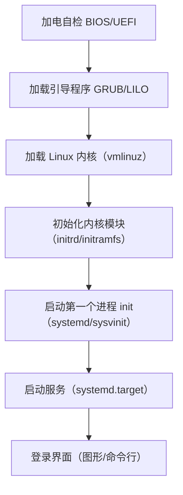
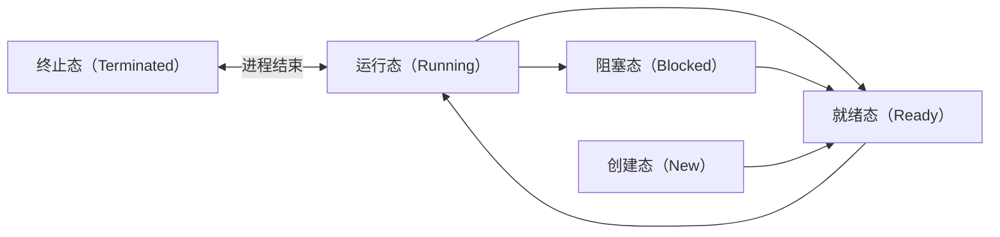
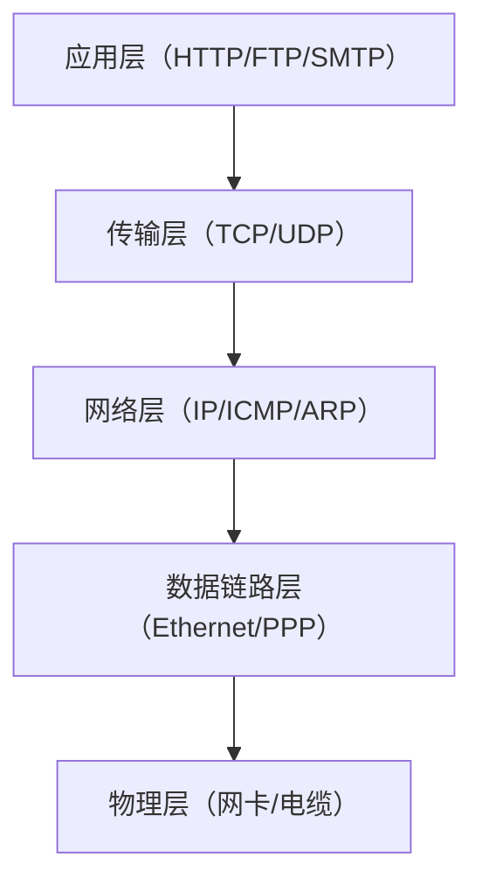
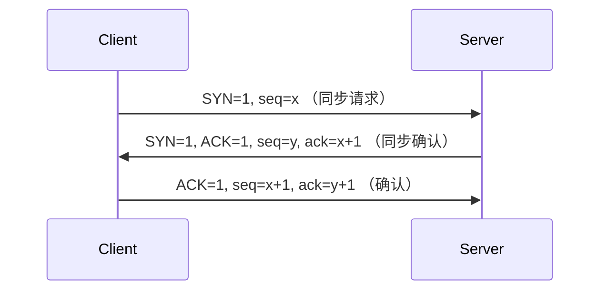
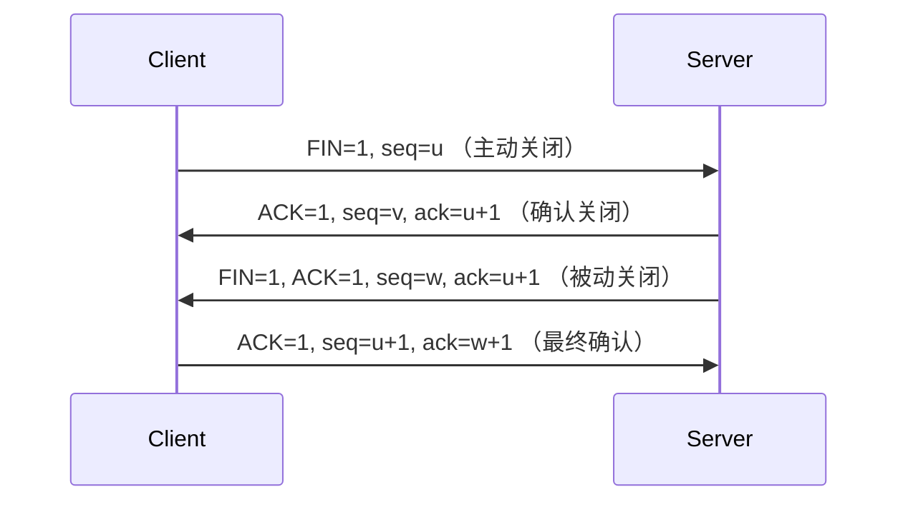

# Linux 核心面试知识点笔记  


## 一、Linux 基础概念  


### 1. Linux 内核与发行版  
#### （1）内核 vs 发行版  
- **内核（Kernel）**：操作系统核心，负责进程调度、内存管理、硬件驱动、文件系统等底层功能（如 Linux 5.15.x）。  
- **发行版（Distro）**：基于内核的完整操作系统，包含 GNU 工具、桌面环境等（如 Ubuntu、CentOS、Debian、Red Hat）。  

#### （2）GNU 工具链  
- 核心组件：`gcc`（编译器）、`glibc`（标准库）、`bash`（命令解释器）、`make`（构建工具）。  
- 作用：提供用户空间工具，实现与内核交互（如 `ls`、`cp`、`rm` 均为用户态程序）。  


### 2. 系统启动流程  



### 3. 高频面试问题  
**Q：用户态与内核态的区别？**  
A：  
- **用户态**：程序运行在低权限模式，不能直接访问硬件和内核资源（如普通 `ls` 命令）；  
- **内核态**：操作系统内核运行在高权限模式，可直接操作硬件（如通过系统调用 `open()` 访问文件）。  

**Q：systemd 与 sysvinit 的区别？**  
A：  
- systemd（Linux 主流）：并行启动服务（加快启动速度），支持服务依赖管理（如 `network.target` 依赖 `syslog.service`）；  
- sysvinit（传统）：串行启动服务（启动慢），依赖脚本 `rc0.d`-`rc6.d` 管理运行级别。  


## 二、文件系统与磁盘管理  


### 1. 文件系统核心概念  
#### （1）常见文件系统  
| 文件系统   | 特点                                                                 | 适用场景                 |  
|------------|----------------------------------------------------------------------|--------------------------|  
| **EXT4**   | 主流日志文件系统，支持大文件（16TB）、延迟分配、多块分配             | Linux 通用场景（默认）   |  
| **XFS**    | 高性能日志文件系统，支持超大文件（8EB）、并行 I/O（适合数据库）       | 高吞吐量存储（如 MySQL） |  
| **NFS**    | 网络文件系统，允许多主机共享文件（通过 RPC 协议）                     | 分布式存储（如 Hadoop）   |  
| **swap**   | 交换分区，内存不足时将数据写入磁盘（提升系统可用性，降低性能）         | 临时内存扩展             |  

#### （2）inode 与 block  
- **inode**：存储文件元信息（权限、大小、创建时间、数据块指针），每个文件唯一；  
- **block**：实际存储数据的物理单元（通常 4KB），通过 inode 指针索引。  

**查看 inode 命令**：  
```bash
stat filename  # 查看文件 inode 信息
ls -i filename  # 查看文件 inode 编号
```  


### 2. 文件权限与管理  
#### （1）权限模型（rwx 755 含义）  
- **用户（User）**：文件所有者（`u`），所属组（`g`），其他用户（`o`）；  
- **权限位**：读（`r=4`）、写（`w=2`）、执行（`x=1`）；  
- **示例**：`755` = `rwx`（用户） + `r-x`（组） + `r-x`（其他）。  

#### （2）权限操作命令  
```bash
chmod 755 dir/          # 修改目录权限
chown user:group file   # 修改文件所有者和所属组
umask 022               # 设置默认权限掩码（新建文件默认权限 = 666 - umask）
```  


### 3. 软硬链接对比  
| 特性       | 硬链接（hard link）          | 软链接（symbolic link）        |  
|------------|-----------------------------|-------------------------------|  
| 本质       | 多个文件名指向同一个 inode    | 独立文件，存储目标文件路径      |  
| 删除原文件 | 不影响硬链接（inode 计数>0）  | 软链接失效（指向不存在的路径）  |  
| 文件类型     | 与原文件类型一致              | 类型为 `lndir`（符号链接）      |  
| 跨分区     | 不支持                        | 支持                            |  

**创建命令**：  
```bash
ln source_file hard_link  # 硬链接
ln -s source_file soft_link  # 软链接
```  


## 三、进程与线程管理  


### 1. 进程基础  
#### （1）进程状态（5 种核心状态）  


#### （2）进程间通信（IPC）方式  
| 方式         | 特点                                                                 | 示例场景                 |  
|--------------|----------------------------------------------------------------------|--------------------------|  
| 管道（Pipe） | 半双工，仅支持父子进程通信                                             | 命令管道 `ls | grep`     |  
| 共享内存     | 最高效，需配合信号量/互斥锁同步                                         | 大数据共享（如机器学习） |  
| 套接字（Socket） | 支持跨主机通信，TCP/UDP 均可                                             | 网络服务（如 Web 服务器） |  
| 信号（Signal） | 异步通知（如 `kill -9` 发送终止信号）                                   | 进程异常处理             |  


### 2. 进程管理命令  
#### （1）进程查看  
```bash
ps aux        # 查看所有进程（BSD 格式）
ps -ef        # 查看所有进程（System V 格式，显示 PID/PPID）
top           # 实时监控进程（按 CPU/内存排序，常用交互键：P（CPU）、M（内存）、k（杀进程））
htop          # 增强版 top，支持树状进程视图
```  

#### （2）进程控制  
```bash
kill PID      # 发送默认信号 SIGTERM（15）
kill -9 PID    # 发送强制终止信号 SIGKILL（9）
nohup command &  # 后台运行命令，忽略挂断信号（日志输出到 nohup.out）
```  


### 3. 线程 vs 进程  
| 特性       | 进程                          | 线程                          |  
|------------|-----------------------------|-------------------------------|  
| 资源分配   | 独立地址空间、文件描述符等    | 共享进程资源（地址空间、打开文件）|  
| 调度单位   | 传统调度单位                  | 现代调度单位（CPU 调度到线程）  |  
| 上下文切换 | 开销大（涉及地址空间切换）    | 开销小（仅寄存器、栈切换）      |  
| 并发模型   | 多进程（如 Apache  prefork）  | 多线程（如 Nginx worker 线程）  |  


### 4. 高频面试问题  
**Q：僵尸进程如何产生？如何处理？**  
A：  
- **产生**：子进程结束，父进程未调用 `wait()`/`waitpid()` 回收资源，状态变为 `Zombie（Z）`；  
- **处理**：  
  1. 杀死父进程（僵尸进程会被 init 进程收养并回收）；  
  2. 编写父进程代码回收子进程（`wait(NULL)`）。  

**Q：孤儿进程如何处理？**  
A：父进程提前终止，子进程被 init 进程（PID=1）收养，init 进程会定期回收孤儿进程资源。  


## 四、网络基础与配置  


### 1. TCP/IP 协议栈（四层模型）  



### 2. 常用网络命令  
#### （1）网络诊断  
```bash
ping IP       # 测试网络连通性（ICMP 协议）
traceroute IP # 追踪路由路径（记录每跳延迟）
nslookup domain # 域名解析（查询 DNS 服务器）
```  

#### （2）端口与进程  
```bash
netstat -tunlp  # 查看所有监听端口及对应进程（-t:TCP，-u:UDP，-n:数字格式，-l:监听状态，-p:进程）
lsof -i:80     # 查看 80 端口占用进程
ss -ant        # 更高效的 netstat 替代工具（socket statistics）
```  

#### （3）网络配置  
```bash
ifconfig       # 查看/配置网卡信息（已逐渐被 ip 命令替代）
ip addr        # 查看 IP 地址
ip route       # 查看路由表
route -n       # 查看路由表（数字格式）
```  


### 3. TCP 三次握手与四次挥手  
#### （1）三次握手（建立连接）  


#### （2）四次挥手（释放连接）  



### 4. 高频面试问题  
**Q：为什么 TCP 建立连接是三次握手，关闭是四次挥手？**  
A：  
- 三次握手：确保双方收发能力正常（Client 确认 Server 收，Server 确认 Client 收+发，Client 确认 Server 发）；  
- 四次挥手：Server 收到 FIN 后，可能仍有数据未发完，需先 ACK 确认，待数据发完再发 FIN（故 ACK 和 FIN 分开发送，导致四次）。  

**Q：TIME_WAIT 状态的作用？**  
A：  
- 确保最后一个 ACK 到达 Server（防止 Server 重发 FIN）；  
- 避免旧连接的数据包干扰新连接（等待 2MSL 时间，确保网络中所有旧包过期）。  


## 五、性能优化与监控  


### 1. 系统资源监控工具  
#### （1）CPU 监控  
```bash
top -c          # 显示进程命令行（-c），按 1 查看所有 CPU 核心
mpstat -P ALL 1  # 按核心统计 CPU 使用率（每 1 秒采样）
```  

#### （2）内存监控  
```bash
free -h         # 查看内存使用（-h 人类可读格式）
vmstat 1        # 实时监控内存、CPU、I/O（每 1 秒刷新）
```  

#### （3）磁盘 I/O 监控  
```bash
iostat -x 1     # 查看磁盘详细 I/O 统计（-x 显示扩展信息，每 1 秒刷新）
df -h           # 查看磁盘空间（-h 人类可读）
du -sh dir/     # 查看目录大小（-s 汇总，-h 人类可读）
```  


### 2. 性能优化方向  
#### （1）CPU 优化  
- 减少上下文切换（合并同类任务，避免频繁线程切换）；  
- 优化程序算法（减少 CPU 密集型操作）。  

#### （2）内存优化  
- 避免内存泄漏（使用 `valgrind` 工具检测）；  
- 减少 Swap 使用（增加物理内存，或优化内存分配策略）。  

#### （3）磁盘 I/O 优化  
- 使用 SSD 替代 HDD（降低随机 I/O 延迟）；  
- 优化文件系统参数（如 EXT4 的 `nobarrier` 模式提升写入速度）。  


### 3. 高频面试问题  
**Q：如何定位 CPU 使用率过高的进程？**  
A：  
1. `top` 找到高 CPU 进程（按 P 排序）；  
2. `ps -mp PID -o THREAD,tid,time` 查看进程内线程 CPU 占用；  
3. `perf top -p PID` 分析进程内热点函数（需安装 `perf` 工具）。  

**Q：swap 空间过大说明什么？如何优化？**  
A：  
- 说明内存不足，系统频繁将数据交换到磁盘（导致性能下降）；  
- 优化：增加物理内存，或通过 `swapoff -a` 临时关闭 swap（谨慎操作，可能导致 OOM）。  


## 六、安全与权限管理  


### 1. 用户与组管理  
#### （1）用户账户文件  
| 文件路径         | 作用                                                                 |  
|------------------|----------------------------------------------------------------------|  
| `/etc/passwd`    | 存储用户基本信息（用户名、UID、家目录、Shell）                       |  
| `/etc/shadow`    | 存储用户密码哈希值（加密存储，需 root 权限访问）                      |  
| `/etc/group`     | 存储组信息（组名、GID、组成员）                                      |  

#### （2）用户操作命令  
```bash
useradd -m user  # 创建用户并创建家目录（-m）
passwd user      # 修改用户密码
usermod -g group user  # 修改用户所属主组
```  


### 2. 防火墙配置（iptables）  
#### （1）核心表与链  
- **表（Table）**：`filter`（过滤包）、`nat`（网络地址转换）、`mangle`（修改包标记）；  
- **链（Chain）**：`INPUT`（入站）、`OUTPUT`（出站）、`FORWARD`（转发）。  

#### （2）常用规则  
```bash
# 允许 SSH 连接（端口 22）
iptables -A INPUT -p tcp --dport 22 -j ACCEPT

# 禁止 IP 192.168.1.100 访问
iptables -A INPUT -s 192.168.1.100 -j DROP

# 端口转发（将 80 端口转发到 8080）
iptables -t nat -A PREROUTING -p tcp --dport 80 -j REDIRECT --to-port 8080
```  


### 3. 高频面试问题  
**Q：如何限制用户只能访问特定目录？**  
A：  
1. 创建用户并指定家目录：`useradd -d /specific/dir -s /sbin/nologin user`（禁止登录）；  
2. 设置目录权限：`chown -R root:user /specific/dir` + `chmod 750 /specific/dir`（仅用户和 root 可访问）。  

**Q：如何防止暴力破解 SSH？**  
A：  
1. 更改 SSH 端口（非默认 22）；  
2. 启用 `fail2ban` 工具（自动封禁多次登录失败的 IP）；  
3. 使用密钥认证替代密码认证（`ssh-keygen` 生成密钥，`authorized_keys` 存储公钥）。  


## 七、总结：高频考点速记  
1. **基础**：内核与发行版区别、systemd 优势、用户态/内核态；  
2. **文件系统**：inode/block 作用、权限模型（755 含义）、软硬链接区别；  
3. **进程管理**：进程状态、IPC 方式、僵尸/孤儿进程处理；  
4. **网络**：三次握手/四次挥手原理、端口查看命令（netstat/lsof）、NAT 原理；  
5. **性能**：top/vmstat/iostat 用法、CPU/内存/I/O 优化方向；  
6. **安全**：用户管理文件、iptables 规则编写、SSH 安全加固。  

通过掌握这些核心知识点，可应对 90% 以上的 Linux 面试问题，重点结合实际场景（如线上故障排查、性能优化）阐述原理和解决方案。