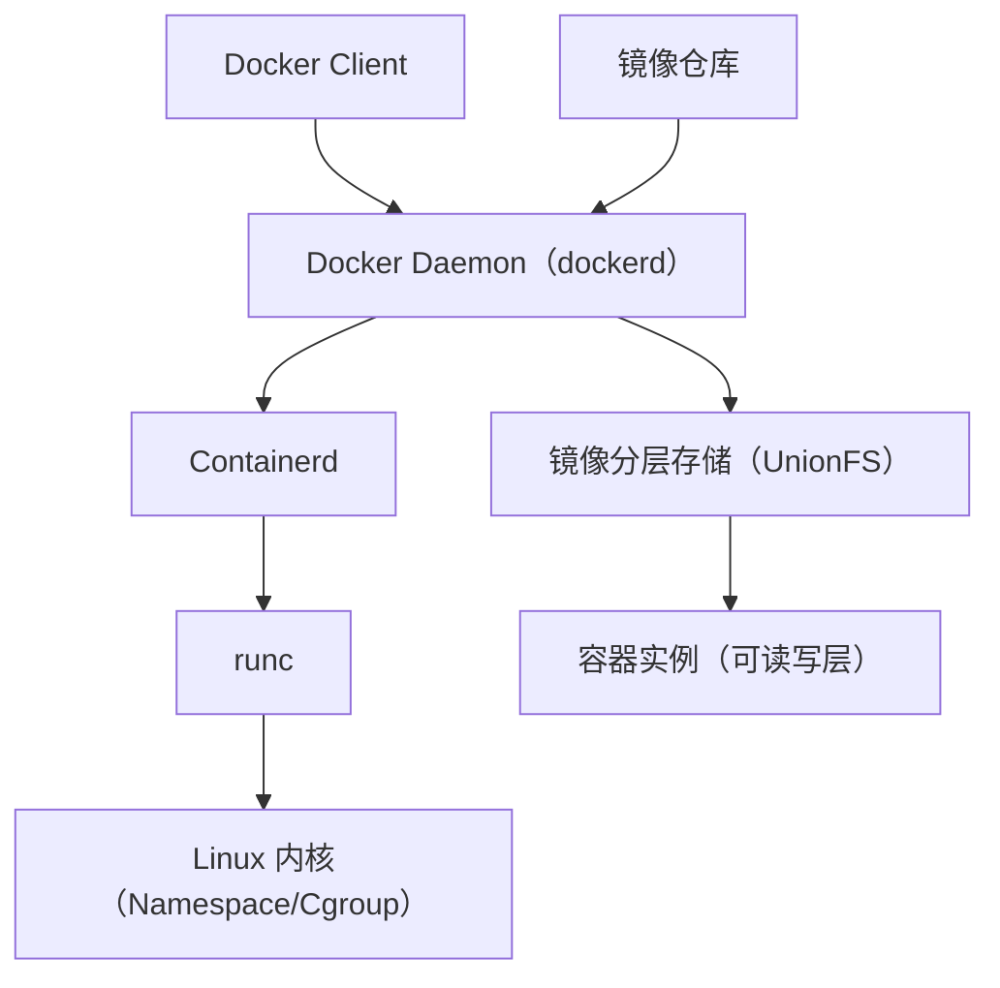

# Docker 核心面试知识点笔记  


## 一、Docker 基础概念  


### 1. 什么是 Docker？  
Docker 是一个开源的**容器化平台**，通过将应用程序及其依赖打包成**镜像（Image）**，运行在**容器（Container）**中，实现**环境隔离、快速部署、资源高效利用**。  


### 2. 核心优势（对比虚拟机）  
| 特性         | 虚拟机（VM）                | 容器（Docker）            |  
|--------------|-----------------------------|---------------------------|  
| **隔离级别** | 硬件级隔离（操作系统级）    | 进程级隔离（内核级）      |  
| **启动时间** | 分钟级                      | 秒级（毫秒级）            |  
| **资源占用** | GB 级（包含完整 OS）        | MB 级（共享宿主机内核）   |  
| **镜像大小** | 数十 GB                     | 数十 MB（分层存储）       |  
| **密度**     | 单主机运行 10~20 个 VM       | 单主机运行 成百上千个容器 |  


### 3. 核心组件  
| 组件         | 作用                                                                 |  
|--------------|----------------------------------------------------------------------|  
| **Docker Engine** | 核心引擎，包含 `dockerd` 守护进程、`containerd`（容器运行时）、`runc`（低层级运行时） |  
| **镜像（Image）** | 只读模板（如 `nginx:1.23`），通过 Dockerfile 构建，支持分层存储（UnionFS） |  
| **容器（Container）** | 镜像的运行实例（可读写），基于镜像创建，支持启停、暂停、删除            |  
| **仓库（Registry）** | 存储镜像的仓库（如 Docker Hub 公有仓库、Harbor 私有仓库）                |  


## 二、Docker 架构与原理  


### 1. 架构图（Mermaid 绘制）  



### 2. 关键技术原理  
#### （1）镜像分层（UnionFS）  
- **分层存储**：镜像由多个只读层（Layer）叠加而成，上层修改不会覆盖下层（如 `docker pull nginx` 下载基础层，`docker commit` 添加自定义层）；  
- **优势**：减少冗余（相同 Layer 共享存储），加速镜像构建（仅重建变化层）。  

#### （2）容器隔离（Namespace + Cgroup）  
| 技术         | 作用                                                                 |  
|--------------|----------------------------------------------------------------------|  
| **Namespace** | 提供命名空间隔离（如 `pid` 隔离进程、`net` 隔离网络、`mnt` 隔离文件系统） |  
| **Cgroup**    | 控制资源配额（CPU、内存、磁盘 I/O），避免容器占用过多资源             |  


### 3. Dockerfile 核心指令  
| 指令       | 作用                                                                 | 示例                                                                 |  
|------------|----------------------------------------------------------------------|----------------------------------------------------------------------|  
| `FROM`     | 指定基础镜像（必须为第一条指令）                                      | `FROM ubuntu:22.04`                                                  |  
| `RUN`      | 执行命令并提交新层（每条 `RUN` 生成一个 Layer）                        | `RUN apt-get update && apt-get install -y curl`                       |  
| `COPY`     | 复制本地文件到镜像                                                   | `COPY app.jar /app.jar`                                              |  
| `CMD`      | 容器启动时执行的默认命令（一个 Dockerfile 仅一个 `CMD`，覆盖用 `docker run`） | `CMD ["java", "-jar", "/app.jar"]`                                   |  
| `EXPOSE`   | 声明容器监听端口（需配合 `docker run -p` 映射）                        | `EXPOSE 8080`                                                        |  
| `VOLUME`   | 定义数据卷（持久化存储，避免数据丢失）                                | `VOLUME /data`                                                       |  


## 三、镜像与容器操作  


### 1. 镜像操作命令  
```bash
# 拉取镜像
docker pull nginx:1.23  

# 构建镜像（-t 打标签，. 表示 Dockerfile 所在目录）
docker build -t myapp:v1 .  

# 查看镜像（分层结构）
docker image ls -a  
docker history myapp:v1  

# 推送镜像到私有仓库
docker login harbor.example.com  
docker tag myapp:v1 harbor.example.com/app/myapp:v1  
docker push harbor.example.com/app/myapp:v1  
```  


### 2. 容器操作命令  
```bash
# 运行容器（-d 后台运行，-p 映射端口，--name 自定义名称）
docker run -d -p 80:80 --name mynginx nginx:1.23  

# 进入容器（-it 交互式，bash 为容器内 Shell）
docker exec -it mynginx bash  

# 查看容器状态（-a 包含已停止容器）
docker ps -a  

# 停止/启动容器
docker stop mynginx  
docker start mynginx  

# 删除容器（-f 强制删除运行中的容器）
docker rm mynginx  
docker rm $(docker ps -aq)  # 删除所有容器
```  


## 四、数据管理与网络  


### 1. 数据持久化方案  
#### （1）Volume（数据卷）  
- **特点**：独立于容器生命周期，支持宿主机与容器双向同步，推荐用于持久化存储；  
- **使用场景**：数据库数据（如 MySQL 的 `/var/lib/mysql`）、日志文件。  

```bash
# 创建并挂载 Volume（宿主机路径自动生成）
docker run -v myvolume:/data nginx  

# 指定宿主机路径挂载（推荐）
docker run -v /host/data:/container/data nginx  
```  

#### （2）Bind Mount（绑定挂载）  
- **特点**：直接挂载宿主机文件/目录，修改实时生效，适合开发环境（如代码热更新）；  
- **风险**：宿主机路径不存在时自动创建（可能导致权限问题）。  

```bash
# 绑定挂载本地目录
docker run -v $(pwd)/app:/app nginx  
```  

#### （3）区别对比  
| 特性         | Volume                      | Bind Mount                |  
|--------------|-----------------------------|---------------------------|  
| 存储位置     | 宿主机 Docker 数据目录       | 任意宿主机路径            |  
| 生命周期     | 独立于容器（需手动删除）     | 依赖宿主机路径存在性      |  
| 镜像无关性   | 支持（适合生产环境）         | 依赖宿主机环境（适合开发）|  


### 2. 网络模型（四大模式）  
#### （1）Bridge（默认模式）  
- **原理**：容器通过虚拟网桥 `docker0` 连接宿主机，宿主机通过 `iptables` 转发网络流量；  
- **配置**：  
  ```bash
  docker run -d -p 80:80 --network bridge nginx  # 显式指定 Bridge 模式
  ```  

#### （2）Host  
- **特点**：容器共享宿主机网络命名空间（IP/端口与宿主机一致），适合高性能网络场景；  
- **风险**：端口冲突（容器端口需与宿主机端口唯一）。  

#### （3）None  
- **特点**：容器无网络连接（仅本地回环接口 `lo`），适合安全敏感场景（如日志收集容器）。  

#### （4）Overlay（集群模式）  
- **作用**：跨宿主机容器通信（Docker Swarm/Kubernetes 集群常用），通过 VXLAN 实现二层网络扩展。  


## 五、面试高频问题详解  


### 1. 镜像 vs 容器的区别？  
| 特性         | 镜像（Image）               | 容器（Container）         |  
|--------------|-----------------------------|---------------------------|  
| 本质         | 只读模板                    | 镜像的运行实例（可读写）  |  
| 生命周期     | 持久化存储                  | 随启停创建/销毁           |  
| 存储位置     | 仓库（Registry）            | 宿主机（可删除）          |  
| 主要操作     | 构建、推送、拉取            | 启动、停止、进入          |  


### 2. 如何优化 Dockerfile？  
#### （1）分层构建最佳实践  
- **合并指令**：将多个 `RUN` 命令合并（减少 Layer 数量），如：  
  ```dockerfile
  RUN apt-get update && apt-get install -y \
      curl \
      wget \
      && apt-get clean  # 清理缓存，减小镜像大小
  ```  
- **利用缓存**：不变的依赖（如 `pom.xml`）先复制，变化的代码后复制，触发缓存复用。  

#### （2）使用多阶段构建  
```dockerfile
# 构建阶段（使用编译环境）
FROM maven:3.8.6-jdk-11 AS build
COPY pom.xml /app/
RUN mvn dependency:resolve
COPY src /app/src
RUN mvn package -DskipTests

# 运行阶段（使用轻量镜像）
FROM openjdk:11-jre-slim
COPY --from=build /app/target/app.jar /app.jar
CMD ["java", "-jar", "/app.jar"]  # 镜像大小减少 50%+
```  


### 3. 容器数据持久化方案如何选择？  
- **生产环境**：使用 `Volume`（自动管理宿主机路径，支持备份/迁移）；  
- **开发环境**：使用 `Bind Mount`（本地代码修改实时生效，无需重建镜像）；  
- **敏感数据**：结合 Secret（如 Docker Swarm 的 Secret 或 Kubernetes 的 Secret），避免明文挂载。  


### 4. Docker 网络模式如何选择？  
- **单容器**：默认 `bridge` 模式（推荐，隔离宿主机网络）；  
- **高性能网络**：`host` 模式（如 Nginx 代理容器，减少网络开销）；  
- **集群通信**：`overlay` 模式（跨主机容器互通，需配合 Swarm/K8s）。  


### 5. Docker 安全问题有哪些？  
#### （1）镜像安全  
- **风险**：镜像包含漏洞（如旧版本 OpenSSL）、恶意软件；  
- **解决方案**：  
  - 使用官方镜像（如 `python:3.12-slim` 替代自定义基础镜像）；  
  - 扫描镜像漏洞（`docker scan myapp:v1` 或第三方工具 Clair）。  

#### （2）权限控制  
- **风险**：容器以 `root` 用户运行，可能破坏宿主机文件；  
- **解决方案**：  
  ```dockerfile
  RUN useradd -m appuser && chown -R appuser /app  # 创建非 root 用户
  USER appuser  # 切换为普通用户运行容器
  ```  

#### （3）资源限制  
- **风险**：容器占用过多宿主机资源（如 CPU 100%、内存 OOM）；  
- **解决方案**：  
  ```bash
  docker run -m 1g --cpu-shares 512 myapp  # 限制内存 1GB，CPU 份额 512（相对值）
  ```  


## 六、总结：核心考点速记  
1. **基础概念**：容器化优势、镜像分层、Namespace/Cgroup 隔离原理；  
2. **核心组件**：Docker Engine 组成（dockerd/containerd/runc）、仓库分类（公有/私有）；  
3. **操作实践**：Dockerfile 优化（分层构建、多阶段构建）、数据卷与绑定挂载区别；  
4. **网络与安全**：四大网络模式适用场景、镜像漏洞扫描、非 root 用户最佳实践；  
5. **面试高频**：镜像 vs 容器、数据持久化方案选择、Docker 安全加固。  

通过结合原理与实践场景（如优化 Dockerfile、解决数据持久化问题），可有效应对面试中的深度提问。