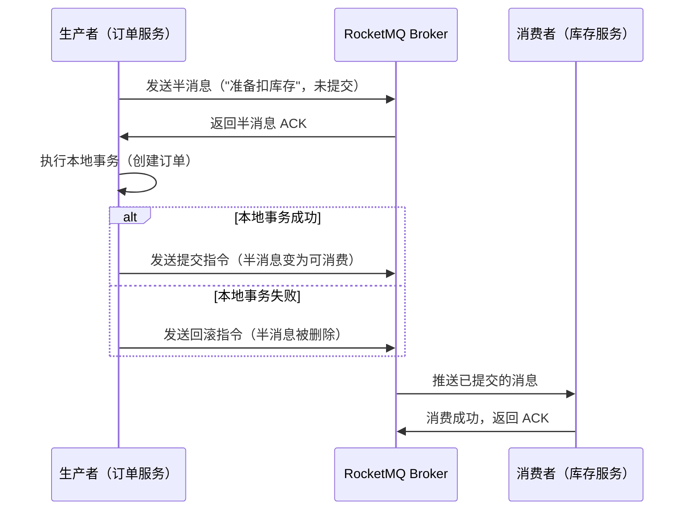
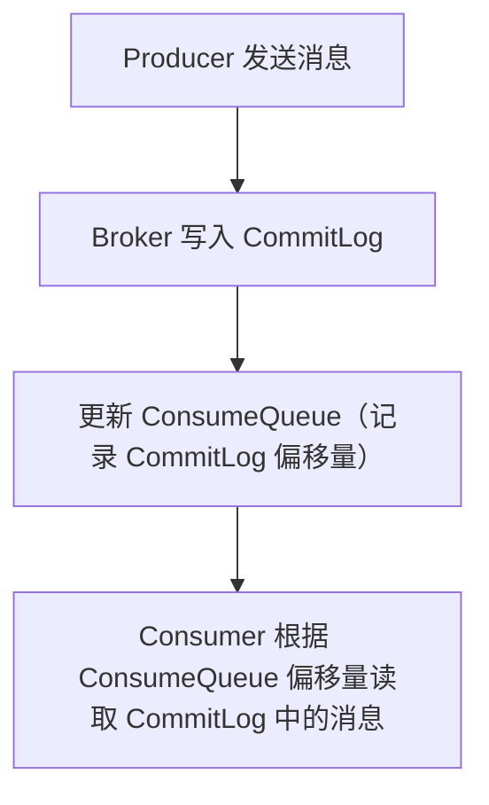

# MQ（消息队列）核心面试知识点笔记  


## 一、为什么需要 MQ？  


### 1. 核心价值  
消息队列（Message Queue, MQ）是分布式系统中的**异步通信中间件**，核心解决以下问题：  


| 问题                | 场景说明                                                                 | MQ 解决方案                                                           |  
|---------------------|--------------------------------------------------------------------------|-----------------------------------------------------------------------|  
| **系统解耦**        | 订单系统需通知库存、物流、支付等多个系统，直接调用导致强依赖             | 订单系统只发消息到 MQ，其他系统订阅消息，互不影响                     |  
| **异步提速**        | 用户下单需同步调用库存扣减、积分发放等耗时操作，响应时间长               | 主流程（下单）完成后，其他操作通过 MQ 异步处理，响应时间从秒级→毫秒级  |  
| **削峰填谷**        | 秒杀活动时，短时间内请求量暴增（10万/秒），超出数据库处理能力（1万/秒）  | MQ 缓存请求（削峰），数据库按稳定速率消费（填谷）                     |  


### 2. 典型使用场景  
- 异步通知（如短信、邮件发送）；  
- 日志收集（微服务日志汇总到 ELK）；  
- 流量控制（秒杀活动的请求缓冲）；  
- 数据同步（MySQL -binlog 通过 MQ 同步到 ES）。  


## 二、常用 MQ 框架对比  


| 特性                | RabbitMQ                                  | Kafka                                     | RocketMQ                                  |  
|---------------------|-------------------------------------------|-------------------------------------------|-------------------------------------------|  
| **出身**            | 基于 AMQP 协议，Erlang 开发               | Apache 项目，Scala/Java 开发              | 阿里开源，Java 开发（现 Apache 顶级项目）  |  
| **吞吐量**          | 万级（1w~5w msg/s）                       | 百万级（10w~100w msg/s）                  | 十万级（10w~50w msg/s）                   |  
| **消息可靠性**      | 支持持久化、ACK、死信队列                 | 支持副本机制（ISR）、持久化               | 支持多副本、同步刷盘、事务消息             |  
| **消息顺序性**      | 单队列保证顺序（多消费者需加锁）          | 分区内严格顺序                            | 分区内严格顺序                            |  
| **适用场景**        | 金融级场景（强一致性）、小规模系统        | 大数据领域（日志采集、流计算）            | 电商、金融等高并发业务场景                |  


## 三、如何保证消息不丢失？  


### 1. 消息丢失的三大环节  
消息从生产到消费的全流程中，可能在 **生产端**、**Broker 端**、**消费端** 三个环节丢失。  


#### （1）生产端丢失：消息未到达 Broker  
**原因**：网络抖动、Broker 宕机，导致消息未成功发送到 MQ。  

**解决方案**：  
- **同步确认**：发送消息后，等待 Broker 返回 ACK（如 RocketMQ 的 `send` 方法同步等待）；  
- **异步确认**：发送消息后，通过回调函数监听发送结果（如 RocketMQ 的 `sendAsync`）；  
- **事务消息**（RocketMQ/Kafka）：确保本地事务与消息发送的原子性（见后文分布式事务部分）。  


**RocketMQ 生产端确认示例**：  
```java
// 同步确认
SendResult result = producer.send(msg);
if (result.getSendStatus() == SendStatus.SEND_OK) {
    // 消息发送成功
}

// 异步确认
producer.send(msg, new SendCallback() {
    @Override
    public void onSuccess(SendResult result) {
        // 消息发送成功
    }
    @Override
    public void onException(Throwable e) {
        // 消息发送失败（重试或记录日志）
    }
});
```  


#### （2）Broker 端丢失：消息存储后未持久化  
**原因**：Broker 未及时刷盘（如异步刷盘时宕机）、副本未同步（如 Kafka 副本数不足）。  

**解决方案**：  
- **持久化配置**：  
  - RocketMQ：启用 **同步刷盘**（`flushDiskType=SYNC_FLUSH`，消息写入磁盘后才返回 ACK）；  
  - Kafka：设置 `acks=all`（消息需同步到所有 ISR 副本才返回 ACK）；  
- **多副本机制**：Broker 部署主从集群（如 RocketMQ 的 Master-Slave 模式，Kafka 的分区副本），避免单节点宕机。  


#### （3）消费端丢失：消息未处理完成即被确认  
**原因**：消费者处理消息时抛出异常，MQ 误以为消息已消费（如自动 ACK）。  

**解决方案**：  
- **手动 ACK**：消费者处理完消息后，主动向 MQ 发送确认（如 RabbitMQ 的 `channel.basicAck`，RocketMQ 的 `ConsumeConcurrentlyStatus.CONSUME_SUCCESS`）；  
- **失败重试与死信队列**：消息处理失败时，MQ 自动重试（需设置最大重试次数），重试失败的消息存入死信队列（人工干预）。  


**RocketMQ 消费端手动确认示例**：  
```java
DefaultMQPushConsumer consumer = new DefaultMQPushConsumer("group1");
consumer.registerMessageListener((MessageListenerConcurrently) (msgs, context) -> {
    try {
        // 处理消息（如扣减库存）
        for (MessageExt msg : msgs) {
            System.out.println(new String(msg.getBody()));
        }
        return ConsumeConcurrentlyStatus.CONSUME_SUCCESS; // 手动确认成功
    } catch (Exception e) {
        return ConsumeConcurrentlyStatus.RECONSUME_LATER; // 失败，触发重试
    }
});
```  


## 四、如何保证消息幂等性？  


### 1. 幂等性定义  
**幂等性**：多次消费同一消息，结果与消费一次一致（如多次扣减库存，最终库存正确）。  


### 2. 消息重复原因  
- 生产端重试（发送失败后重复发送）；  
- 消费端 ACK 未成功（MQ 未收到确认，重复推送）。  


### 3. 幂等性实现方案  


| 方案                | 实现原理                                                                 | 示例代码/说明                                                         |  
|---------------------|--------------------------------------------------------------------------|-----------------------------------------------------------------------|  
| **全局唯一 ID**     | 每条消息生成唯一 ID（如 UUID），消费时校验是否已处理                     | 数据库：`INSERT INTO msg_log (msg_id) VALUES (?) ON DUPLICATE KEY UPDATE ...` |  
| **状态机校验**      | 业务操作有明确的状态流转（如订单状态：未支付→已支付→已发货）             | 消费时检查当前状态是否允许操作（如“已支付”才能发货）                    |  
| **Redis 去重**      | 使用 Redis 记录已处理的消息 ID（设置过期时间）                           | `if (redis.setNX(msgId, "1", 3600)) { 处理消息 }`                     |  


**数据库唯一索引示例**：  
```sql
-- 创建消息日志表（msg_id 唯一索引）
CREATE TABLE msg_log (
    id INT PRIMARY KEY AUTO_INCREMENT,
    msg_id VARCHAR(64) UNIQUE,  -- 消息全局唯一 ID
    status TINYINT DEFAULT 0    -- 0:未处理 1:已处理
);

-- 消费消息时，先插入或更新状态
INSERT INTO msg_log (msg_id, status) VALUES ('uuid-123', 1) 
ON DUPLICATE KEY UPDATE status = 1;  -- 重复消息自动忽略
```  


## 五、如何保证消息顺序性？  


### 1. 顺序性的两种场景  
| 场景                | 说明                                                                     | 典型案例                                                              |  
|---------------------|--------------------------------------------------------------------------|-----------------------------------------------------------------------|  
| **全局顺序**        | 所有消息按发送顺序被消费                                                 | 银行流水记录（必须按时间顺序处理）                                    |  
| **分区顺序**        | 同一分组内的消息按顺序消费（不同分组可并行）                             | 电商订单（同一订单的消息需顺序处理，不同订单可并行）                  |  


### 2. 实现方法  


#### （1）生产端：消息路由到同一队列/分区  
- **RabbitMQ**：将消息发送到同一个队列（单消费者）；  
- **Kafka/RocketMQ**：通过自定义路由策略，将同一分组的消息发送到同一分区（如订单 ID 取模分区数）。  


**RocketMQ 自定义路由示例**：  
```java
// 自定义消息队列选择器（按订单 ID 路由到固定队列）
MessageQueueSelector selector = (mqs, msg, arg) -> {
    Long orderId = (Long) arg;  // 订单 ID
    int index = (int) (orderId % mqs.size());
    return mqs.get(index);  // 同一订单 ID 路由到同一队列
};

producer.send(msg, selector, orderId);  // 发送时指定路由参数
```  


#### （2）消费端：单线程消费同一队列/分区  
- **RabbitMQ**：单消费者实例 + 关闭自动 ACK；  
- **Kafka/RocketMQ**：消费端为每个分区分配一个线程（或限制并发数为 1）。  


**RocketMQ 顺序消费配置**：  
```java
consumer.setMessageModel(MessageModel.CLUSTERING);  // 集群消费模式（负载均衡）
consumer.registerMessageListener(new MessageListenerOrderly() {  // 顺序消费监听器
    @Override
    public ConsumeOrderlyStatus consumeMessage(List<MessageExt> msgs, ConsumeOrderlyContext context) {
        for (MessageExt msg : msgs) {
            // 按顺序处理消息（单线程）
        }
        return ConsumeOrderlyStatus.SUCCESS;
    }
});
```  


## 六、MQ 高效读写：零拷贝技术  


### 1. 传统 IO 读写流程的问题  
传统文件读写需经过 **用户态→内核态→用户态** 的数据拷贝，涉及 4 次数据复制和 2 次上下文切换，效率低下。  


### 2. 零拷贝（Zero-Copy）原理  
通过操作系统优化，减少数据拷贝次数。MQ 主要使用两种零拷贝技术：  


#### （1）mmap（内存映射）  
将文件直接映射到用户态内存，避免用户态与内核态的拷贝。RocketMQ 的 `CommitLog`（消息存储文件）即使用 `mmap` 实现高效写入。  


#### （2）sendfile（内核直接传输）  
数据从文件→内核缓冲区→Socket 缓冲区，无需经过用户态。Kafka 的消息拉取（`fetch`）使用 `sendfile` 优化网络传输。  


### 3. RocketMQ 存储优化  
RocketMQ 通过 **顺序写 + 零拷贝** 实现百万级 TPS：  
- **顺序写**：所有消息追加写入 `CommitLog`（单个大文件），避免随机 IO；  
- **内存映射**：`CommitLog` 通过 `mmap` 映射到内存，写入速度接近内存；  
- **异步刷盘**（可选同步）：消息先写入内存，定时刷盘（降低 IO 压力）。  


## 七、MQ 与分布式事务的最终一致性  


### 1. 问题背景  
分布式系统中，跨服务的事务（如“下单+扣库存+发优惠券”）无法通过本地事务保证一致性，需通过 MQ 实现**最终一致**。  


### 2. 解决方案：RocketMQ 事务消息  


#### （1）核心流程（时序图）  



#### （2）关键机制  
- **半消息**：消息发送到 MQ 但未提交，对消费者不可见；  
- **事务回查**：若 MQ 未收到提交/回滚指令，主动查询生产者本地事务状态（防止生产者宕机）；  
- **最终一致**：消费者处理消息失败时，MQ 自动重试（确保最终成功）。  


**RocketMQ 事务消息代码示例**：  
```java
// 1. 创建事务生产者
TransactionMQProducer producer = new TransactionMQProducer("tx_group");
producer.setTransactionListener(new TransactionListener() {
    @Override
    public LocalTransactionState executeLocalTransaction(Message msg, Object arg) {
        // 执行本地事务（如创建订单）
        boolean orderSuccess = createOrder(); 
        return orderSuccess ? LocalTransactionState.COMMIT_MESSAGE : LocalTransactionState.ROLLBACK_MESSAGE;
    }

    @Override
    public LocalTransactionState checkLocalTransaction(MessageExt msg) {
        // MQ 回查本地事务状态（如查询订单是否创建）
        boolean orderExists = checkOrderExists(); 
        return orderExists ? LocalTransactionState.COMMIT_MESSAGE : LocalTransactionState.ROLLBACK_MESSAGE;
    }
});

// 2. 发送半消息
Message msg = new Message("topic", "tag", "扣库存".getBytes());
producer.sendMessageInTransaction(msg, null);
```  


## 八、RocketMQ 详细解析  


### 1. 核心组成  


| 组件                | 作用                                                                     |  
|---------------------|--------------------------------------------------------------------------|  
| **NameServer**      | 路由中心（无状态，集群部署），存储 Broker 地址、Topic 路由信息            |  
| **Broker**          | 消息存储与转发（Master-Slave 模式，支持同步/异步复制）                    |  
| **Producer**        | 消息生产者（支持事务消息、顺序消息）                                      |  
| **Consumer**        | 消息消费者（Push/Pull 模式，集群/广播消费）                               |  


### 2. 存储机制（三级结构）  


#### （1）CommitLog（消息日志）  
- 所有消息按顺序追加写入（单文件 1GB，顺序写速度≈内存）；  
- 存储内容：消息体、Topic、队列 ID、物理偏移量等。  


#### （2）ConsumeQueue（消费队列）  
- 每个 Topic 的每个队列对应一个 `ConsumeQueue`（索引文件）；  
- 存储内容：消息在 `CommitLog` 中的物理偏移量、消息长度、Tag 哈希值。  


#### （3）IndexFile（索引文件）  
- 基于消息 Key 或时间戳的快速查询索引；  
- 存储内容：Key 哈希值、消息偏移量、时间戳等。  


**存储结构流程图**：  



### 3. 负载均衡  


#### （1）Producer 消息路由  
- **默认策略**：轮询选择 Topic 的队列（保证消息均匀分布）；  
- **自定义策略**：按业务规则（如订单 ID）路由到固定队列（保证顺序性）。  


#### （2）Consumer 负载分配  
- **集群消费**（默认）：多个消费者实例分摊队列（如 5 个队列 + 2 个消费者 → 3+2 分配）；  
- **广播消费**：每个消费者实例消费所有队列（用于通知类场景）。  


## 九、高频面试问题总结  


### 1. 如何保证消息不丢失？  
答：分三环节：  
- 生产端：同步/异步确认、事务消息；  
- Broker 端：同步刷盘、多副本；  
- 消费端：手动 ACK、失败重试+死信队列。  


### 2. 消息幂等性的实现方式？  
答：全局唯一 ID（数据库唯一索引/Redis 去重）、状态机校验。  


### 3. 如何保证消息顺序？  
答：生产端将同一分组消息路由到同一队列/分区；消费端单线程消费同一队列。  


### 4. RocketMQ 为什么快？  
答：顺序写 CommitLog（避免随机 IO）、mmap 内存映射（零拷贝写入）、sendfile 网络传输（零拷贝读取）。  


### 5. RocketMQ 事务消息的流程？  
答：发送半消息→执行本地事务→提交/回滚→消费者消费；事务回查机制保证本地事务状态可查询。  


通过本文的梳理，可系统掌握 MQ 的核心机制及面试高频问题，应对分布式系统通信、高并发场景的技术提问。