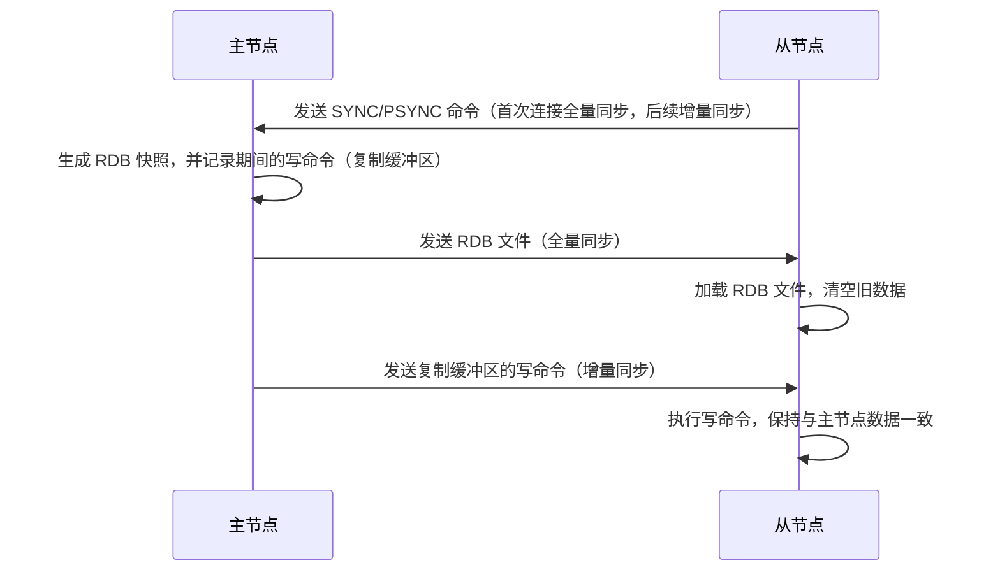

# Redis 核心面试知识点笔记  


## 一、Redis 集群模式  


### 1. 主从集群（Master-Slave）  
**核心目标**：解决单点故障问题，实现数据冗余和读请求负载均衡。  


#### （1）主从复制流程（全量 + 增量同步）  



#### （2）哨兵机制（Sentinel）  
**作用**：监控主从节点状态，自动故障转移（主节点宕机时，提升从节点为主节点）。  

**关键流程**：  
1. **监控**：哨兵定期向主从节点发送 PING 命令，判断节点是否存活；  
2. **故障转移**：当多数哨兵认为主节点宕机（`quorum` 阈值），选举一个哨兵执行故障转移，提升从节点为主节点，并更新其他从节点的主节点指向。  


### 2. Redis Cluster（分布式集群）  
**核心目标**：解决单集群内存限制问题，支持水平扩展（最大 1000+ 节点）。  


#### （1）分片原理（哈希槽）  
- Redis Cluster 将数据划分为 **16384 个哈希槽（Hash Slot）**，每个节点负责一部分哈希槽；  
- 数据路由：通过 `CRC16(key) % 16384` 计算键对应的哈希槽，路由到负责该槽的节点；  
- 扩容缩容：通过迁移哈希槽实现节点增删（无需全量迁移数据）。  


#### （2）集群通信（Gossip 协议）  
节点间通过 **Gossip 协议**（端口号 + 10000）交换状态信息（如节点存活、哈希槽迁移进度），通信开销低（仅广播给少量节点）。  


## 二、缓存三大问题与解决方案  


### 1. 缓存穿透（Cache Penetration）  
**定义**：查询一个不存在于缓存和数据库中的 key（如 `id=-1`），导致请求直接穿透到数据库。  


#### （1）危害  
数据库压力激增（尤其高频无效请求）。  


#### （2）解决方案  
| 方案                | 原理                                                                 | 示例代码                                                                 |  
|---------------------|----------------------------------------------------------------------|--------------------------------------------------------------------------|  
| **布隆过滤器**       | 预存所有可能的 key，请求时先检查是否存在，不存在直接返回               | 使用 Guava `BloomFilter` 或 RedisBloom 模块                                |  
| **空值缓存**         | 缓存不存在的 key（设置短过期时间），避免重复查库                      | `redis.set(key, "", 60)`（60s 后自动删除）                               |  


### 2. 缓存雪崩（Cache Avalanche）  
**定义**：大量缓存 key 同一时间过期（或缓存节点宕机），导致请求集中穿透到数据库。  


#### （1）解决方案  
| 方案                | 原理                                                                 |  
|---------------------|----------------------------------------------------------------------|  
| **随机过期时间**     | 缓存 key 的过期时间添加随机值（如 `expire = 60*60 + random(300)`）     |  
| **缓存集群化**       | 使用 Redis Cluster 或主从集群，避免单节点宕机导致大面积失效            |  
| **降级/限流**        | 数据库压力过大时，对非核心业务降级（返回默认值）或限流                 |  


### 3. 缓存击穿（Cache Breakdown）  
**定义**：热点 key 过期时，大量请求同时穿透到数据库（如秒杀活动的商品信息）。  


#### （1）解决方案  
| 方案                | 原理                                                                 | 示例代码                                                                 |  
|---------------------|----------------------------------------------------------------------|--------------------------------------------------------------------------|  
| **互斥锁（Mutex）**  | 仅允许一个线程查询数据库，其他线程等待缓存更新                         | 使用 Redis `set key lock NX PX 1000` 获取互斥锁                          |  
| **热点预加载**       | 手动设置热点 key 永不过期（或后台线程定时刷新）                        | 定时任务：`redis.expire(key, 3600)`（每小时刷新过期时间）                 |  


## 三、淘汰策略（过期删除 + 内存淘汰）  


### 1. 过期删除策略  
Redis 采用 **定期删除 + 惰性删除** 结合的方式：  

| 策略                | 原理                                                                 | 缺点                                                                 |  
|---------------------|----------------------------------------------------------------------|----------------------------------------------------------------------|  
| **定期删除**         | 每秒 10 次随机检查部分过期 key，删除已过期的                          | 可能漏掉部分过期 key（需惰性删除补充）                                 |  
| **惰性删除**         | 访问 key 时检查是否过期，过期则删除并返回空                           | 未被访问的过期 key 会长期占用内存                                     |  


### 2. 内存淘汰策略（当内存不足时）  
Redis 提供 8 种内存淘汰策略（`maxmemory-policy`），核心逻辑如下：  


| 策略                | 说明                                                                 | 适用场景                                                             |  
|---------------------|----------------------------------------------------------------------|----------------------------------------------------------------------|  
| **noeviction**       | 禁止写入（返回错误），仅允许读                                       | 对数据一致性要求极高（如缓存不可丢失）                                 |  
| **allkeys-lru**      | 所有 key 中淘汰最久未使用的（Least Recently Used）                   | 通用场景（热点数据保留）                                               |  
| **allkeys-random**   | 所有 key 中随机淘汰                                                   | 数据访问无明显热点                                                     |  
| **volatile-lru**     | 仅淘汰设置了过期时间的 key 中最久未使用的                             | 部分 key 需保留（如永不过期的配置）                                   |  


**示例配置**（`redis.conf`）：  
```conf
maxmemory 2gb                  # 限制最大内存 2GB
maxmemory-policy allkeys-lru   # 内存不足时淘汰最久未使用的 key
```  


## 四、分布式锁实现  


### 1. 为什么需要分布式锁？  
- 单机锁（如 `synchronized`）无法跨 JVM 控制分布式系统的并发；  
- 场景：秒杀库存扣减、分布式任务调度（避免重复执行）。  


### 2. Redis 实现分布式锁（基础版）  


#### （1）核心命令（原子性是关键）  
使用 `SET key value NX PX milliseconds` 命令（`NX`：仅当 key 不存在时设置；`PX`：设置过期时间）：  
```java
// Jedis 示例代码（Java）
String lockKey = "order:lock:1001";
String requestId = UUID.randomUUID().toString(); // 唯一标识客户端
boolean locked = jedis.set(lockKey, requestId, "NX", "PX", 30000); // 30s 过期
if (locked) {
    try {
        // 执行业务逻辑（如扣减库存）
    } finally {
        jedis.eval("if redis.call('get', KEYS[1]) == ARGV[1] then return redis.call('del', KEYS[1]) else return 0 end", 
                   Collections.singletonList(lockKey), 
                   Collections.singletonList(requestId)); // 释放锁（Lua 保证原子性）
    }
}
```  


#### （2）关键要求  
- **互斥性**：同一时间仅一个客户端持有锁；  
- **防死锁**：锁必须有过期时间（避免节点宕机锁无法释放）；  
- **解铃还须系铃人**：仅锁的持有者能释放锁（通过 `requestId` 校验）。  


### 3. 进阶问题与优化  


#### （1）锁过期时间太短  
**问题**：业务逻辑执行时间超过锁过期时间，导致其他客户端获取锁，引发并发问题。  

**解决方案**：  
- 使用 **Redisson**（自动续期，`WatchDog` 机制每 10s 续期 30s）；  
- 手动计算业务耗时，设置合理的过期时间（如 `过期时间 = 业务耗时 * 2`）。  


#### （2）可重入锁  
**问题**：同一客户端多次获取同一锁需支持重入（如递归调用）。  

**解决方案**：  
Redisson 实现可重入锁（通过 `Hash` 结构记录 `lockKey:requestId` 的加锁次数，解锁时递减）。  


#### （3）红锁（RedLock）争议  
**场景**：Redis 主从集群中，主节点宕机导致锁未同步到从节点，从节点提升为主节点后，新客户端可重复获取锁。  

**RedLock 方案**：  
- 向 N 个独立的 Redis 节点（非主从）同时申请锁；  
- 仅当超过半数节点加锁成功，才认为锁获取成功。  

**争议**：需权衡复杂度与一致性（实际中 Redisson 已优化，多数场景无需 RedLock）。  


## 五、二级缓存一致性（Redis + DB）  


### 1. 常见更新策略对比  
| 策略                | 流程                                                                 | 一致性风险                                                             |  
|---------------------|----------------------------------------------------------------------|----------------------------------------------------------------------|  
| **先删缓存，后写 DB** | 1. 删除缓存；<br>2. 写数据库                                           | 并发时可能出现“缓存未删，DB 已写”，导致旧数据回刷缓存                   |  
| **先写 DB，后删缓存** | 1. 写数据库；<br>2. 删除缓存                                           | 缓存未删时，其他请求读取到旧缓存（短暂不一致，最终一致）               |  


### 2. 不一致原因与解决  


#### （1）原因  
- 缓存删除失败（网络问题）；  
- 写 DB 耗时较长，期间缓存被读取（旧数据）。  


#### （2）解决方案  
| 方案                | 原理                                                                 | 示例                                                                 |  
|---------------------|----------------------------------------------------------------------|----------------------------------------------------------------------|  
| **延迟双删**         | 写 DB 后，先删缓存，等待 1s 后再次删缓存（确保 DB 写操作完成）          | `deleteCache(key); Thread.sleep(1000); deleteCache(key);`            |  
| **消息队列**         | 将缓存删除操作发送到 MQ，确保最终删除成功                              | 使用 RocketMQ 发送 `DELETE_CACHE` 消息，消费失败则重试                 |  
| **强一致方案**       | 使用 Tair（阿里分布式缓存）等支持“缓存 + DB” 事务的产品                 | Tair 的 `put` 操作自动同步 DB，保证原子性                             |  


## 六、Keys 命令与大 Key 问题  


### 1. Keys 命令的危害  
- **阻塞主线程**：`KEYS *` 是 O(n) 操作，n 很大时（如百万级 key）会导致 Redis 无法处理其他请求；  
- **CPU 耗尽**：遍历所有 key 会占用大量 CPU 时间，影响性能。  


**替代方案**：使用 `SCAN` 命令（基于游标的迭代器，分批次返回，不阻塞主线程）：  
```shell
SCAN 0 MATCH user:* COUNT 100  # 分批次扫描所有以 "user:" 开头的 key（每次返回 100 条）
```  


### 2. 大 Key 的危害与解决  


#### （1）大 Key 定义  
- 字符串类型：单个 key 的 value 超过 10KB；  
- 哈希/列表/集合类型：元素数量超过 1000 个。  


#### （2）危害  
| 问题                | 描述                                                                 |  
|---------------------|----------------------------------------------------------------------|  
| **内存分布不均**     | 大 Key 集中在少数节点，导致集群内存浪费                               |  
| **操作耗时**         | `DEL`、`HGETALL` 等命令耗时，阻塞主线程                               |  
| **网络阻塞**         | 大 Key 传输占用带宽，影响其他请求响应时间                             |  


#### （3）解决方法  
| 方案                | 说明                                                                 | 示例                                                                 |  
|---------------------|----------------------------------------------------------------------|----------------------------------------------------------------------|  
| **拆分大 Key**       | 将大 Key 按业务逻辑拆分为多个小 Key（如按时间、地域分片）              | `user:1001:orders` 拆分为 `user:1001:orders:202401`、`user:1001:orders:202402` |  
| **异步删除**         | 使用 `UNLINK` 替代 `DEL`（异步删除，不阻塞主线程）                     | `UNLINK big_key`                                                     |  
| **监控与报警**       | 通过 `redis-cli --bigkeys` 定期扫描大 Key，设置阈值报警                | 每周执行 `redis-cli --bigkeys` 分析大 Key 分布                        |  


## 七、高频面试问题总结  


### 1. Redis 主从集群如何保证数据一致？  
答：通过主从复制（全量同步 + 增量同步）。主节点生成 RDB 快照发送给从节点，之后通过复制缓冲区记录写命令，异步同步给从节点。  


### 2. 缓存穿透和缓存击穿的区别？  
答：  
- 穿透：查询不存在的 key（缓存和 DB 都没有）；  
- 击穿：查询存在但缓存过期的热点 key（DB 有，缓存无）。  


### 3. Redis 分布式锁为什么用 Lua 脚本释放锁？  
答：保证“查询锁是否存在”和“删除锁”的原子性。若不用 Lua，可能出现“查询锁存在后，锁过期被其他客户端获取，此时删除锁会误删”。  


### 4. 大 Key 如何处理？  
答：拆分大 Key 为小 Key（按时间、地域分片），使用 `UNLINK` 异步删除，定期通过 `--bigkeys` 监控。  


### 5. 二级缓存如何保证一致性？  
答：推荐“先写 DB，后删缓存” + 延迟双删（删除后等待 1s 再次删除）；或使用消息队列确保缓存删除成功；强一致场景可使用 Tair 等支持事务的缓存产品。  


通过本文的梳理，可系统掌握 Redis 核心机制及面试高频问题，应对分布式缓存、集群架构等场景的深度提问。