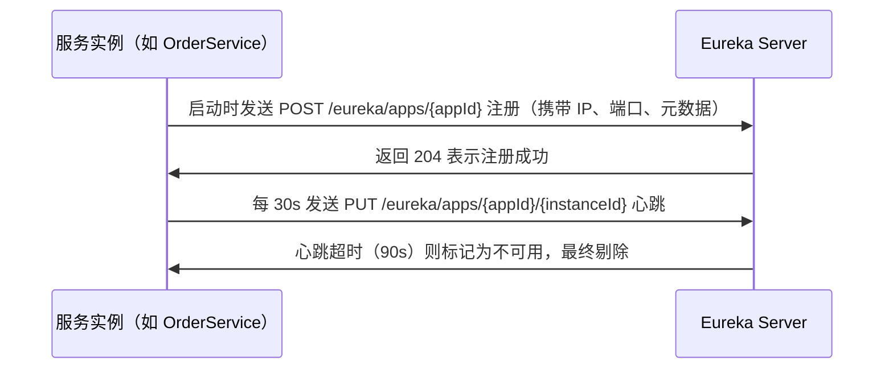
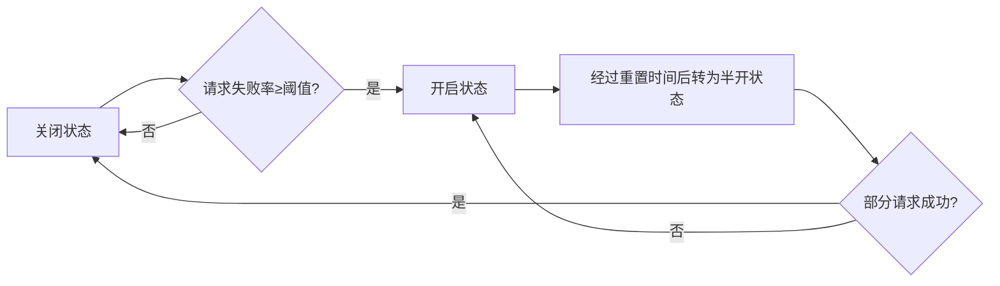
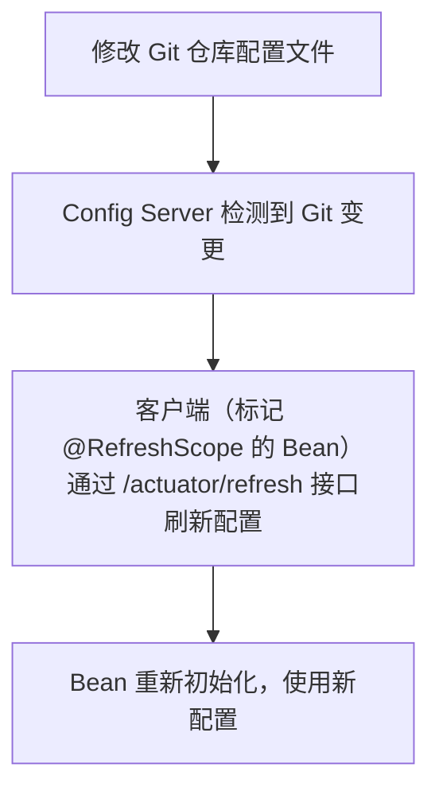
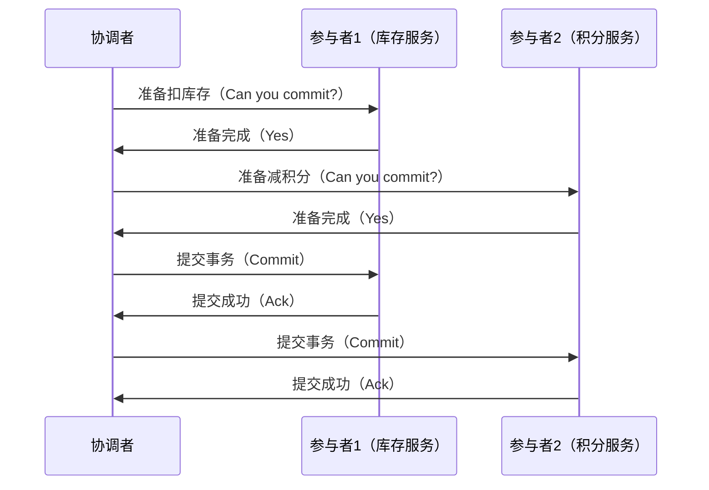
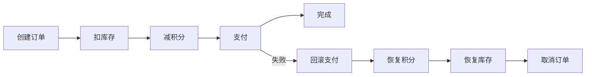
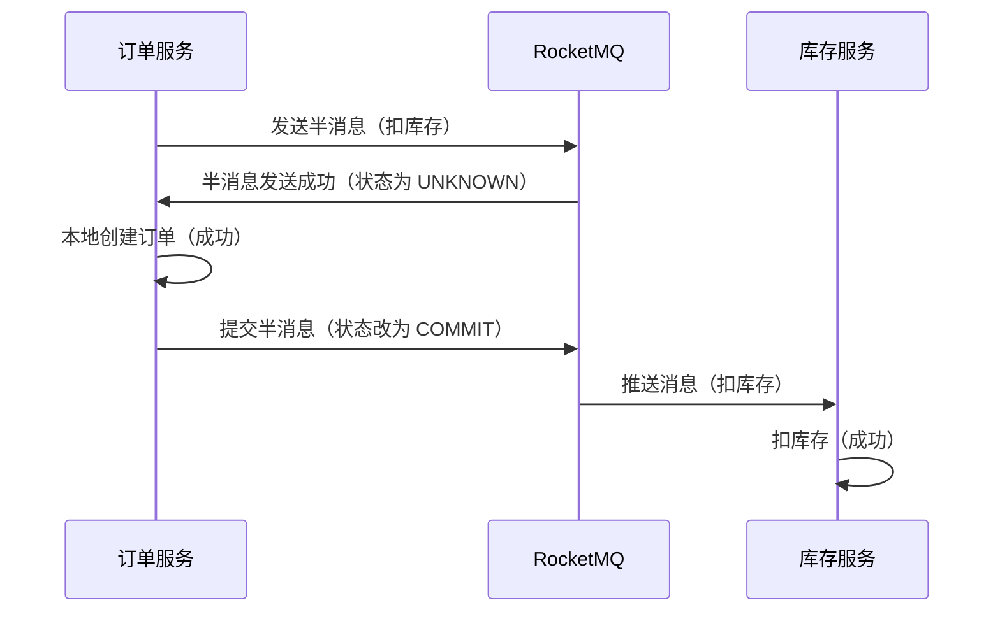

# Spring Cloud 核心面试知识点笔记  


## 一、核心注解  


### 1. 服务注册与发现注解  
| 注解                  | 作用                                                                 | 示例                                                                 |  
|-----------------------|----------------------------------------------------------------------|----------------------------------------------------------------------|  
| `@EnableEurekaServer`  | 声明当前服务为 Eureka 注册中心（服务端）                              | `@EnableEurekaServer public class EurekaServerApplication { ... }`  |  
| `@EnableDiscoveryClient` | 声明当前服务为 Eureka/Consul/Nacos 客户端（注册到注册中心）          | `@EnableDiscoveryClient public class OrderServiceApplication { ... }` |  


### 2. 负载均衡注解  
| 注解                  | 作用                                                                 | 示例                                                                 |  
|-----------------------|----------------------------------------------------------------------|----------------------------------------------------------------------|  
| `@LoadBalanced`        | 标记 `RestTemplate` 或 `WebClient` 开启负载均衡（结合 Ribbon 或 Spring Cloud LoadBalancer） | `@Bean @LoadBalanced public RestTemplate restTemplate() { ... }`     |  


### 3. 熔断器注解  
| 注解                  | 作用                                                                 | 示例                                                                 |  
|-----------------------|----------------------------------------------------------------------|----------------------------------------------------------------------|  
| `@HystrixCommand`      | 标记方法启用 Hystrix 熔断和降级（已过时，推荐 Resilience4J）          | `@HystrixCommand(fallbackMethod = "fallback") public String callService() { ... }` |  
| `@CircuitBreaker`      | Resilience4J 熔断器注解（Spring Cloud Circuit Breaker 抽象）          | `@CircuitBreaker(name = "orderService", fallbackMethod = "fallback")` |  


### 4. 声明式调用注解  
| 注解                  | 作用                                                                 | 示例                                                                 |  
|-----------------------|----------------------------------------------------------------------|----------------------------------------------------------------------|  
| `@FeignClient`         | 声明一个 Feign 客户端接口（自动生成代理类调用远程服务）              | `@FeignClient(name = "product-service") public interface ProductFeignClient { ... }` |  


### 5. 配置中心注解  
| 注解                  | 作用                                                                 | 示例                                                                 |  
|-----------------------|----------------------------------------------------------------------|----------------------------------------------------------------------|  
| `@RefreshScope`        | 标记 Bean 支持配置动态刷新（当配置中心配置变更时，重新加载 Bean）     | `@RefreshScope @Service public class ConfigService { ... }`          |  


## 二、核心组件详解  


### 1. 服务注册与发现（Service Discovery）  
**核心作用**：解决分布式系统中服务实例的动态管理（注册、发现、健康检查）。  


#### 典型组件：Eureka / Nacos  
| 特性                | Eureka                                  | Nacos                                   |  
|---------------------|-----------------------------------------|-----------------------------------------|  
| 注册中心类型         | AP（可用优先，牺牲强一致性）            | 支持 AP/CP 模式（可切换）               |  
| 健康检查             | 客户端心跳（默认 30s）                  | 客户端心跳 + 服务端主动检查             |  
| 自我保护机制         | 开启（防止误删存活实例）                | 支持（可配置）                          |  
| 配置中心集成         | 无（需额外整合 Spring Cloud Config）   | 内置配置中心（Nacos Config）            |  


#### 服务注册流程（以 Eureka 为例）  



### 2. 负载均衡（Load Balancing）  
**核心作用**：将请求均匀分发到多个服务实例，避免单点压力过大。  


#### 典型组件：Ribbon（已淘汰） / Spring Cloud LoadBalancer  
| 特性                | Ribbon                                  | Spring Cloud LoadBalancer               |  
|---------------------|-----------------------------------------|-----------------------------------------|  
| 状态                | 已停止维护                              | 官方推荐（轻量、支持 Reactor）          |  
| 负载策略            | 轮询、随机、权重等（可自定义）          | 轮询、随机（默认），支持自定义策略       |  
| 集成方式            | 与 Feign 深度绑定                       | 独立组件，支持 RestTemplate/WebClient   |  


#### 代码示例：LoadBalanced RestTemplate  
```java
@Configuration
public class LoadBalancerConfig {
    @Bean
    @LoadBalanced // 开启负载均衡
    public RestTemplate restTemplate() {
        return new RestTemplate();
    }
}

@Service
public class OrderService {
    @Autowired
    private RestTemplate restTemplate;

    public String getProductInfo() {
        // 直接使用服务名（如 "product-service"）调用，LoadBalanced 自动解析实例
        return restTemplate.getForObject("http://product-service/api/product", String.class);
    }
}
```  


### 3. 熔断器（Circuit Breaker）  
**核心作用**：防止服务雪崩（某个服务故障时，快速拒绝后续请求，避免级联失败）。  


#### 典型组件：Hystrix（已淘汰） / Resilience4J  
| 特性                | Hystrix                                 | Resilience4J                              |  
|---------------------|-----------------------------------------|-------------------------------------------|  
| 状态                | 已停止维护                              | 活跃维护（轻量、支持函数式编程）          |  
| 熔断条件            | 错误率 ≥50% + 一定时间内请求数 ≥20       | 可配置错误率、慢请求率、异常类型          |  
| 降级方式            | 注解 `@HystrixCommand`                  | 注解 `@CircuitBreaker` 或编程式          |  


#### 熔断状态机（Resilience4J）  



### 4. 网关（API Gateway）  
**核心作用**：统一入口，提供路由、鉴权、限流、日志等功能。  


#### 典型组件：Zuul 1.x（已淘汰） / Spring Cloud Gateway  
| 特性                | Zuul 1.x                                | Spring Cloud Gateway                      |  
|---------------------|-----------------------------------------|-------------------------------------------|  
| 架构                | 同步 I/O（基于 Servlet）                | 异步非阻塞（基于 Reactor + Netty）        |  
| 路由规则            | 简单路径匹配                            | 支持谓词（Predicate）+ 过滤器（Filter）   |  
| 性能                | 低（同步阻塞）                          | 高（异步非阻塞，适合高并发）              |  


#### 配置示例：Gateway 路由规则  
```yaml
# application.yml
spring:
  cloud:
    gateway:
      routes:
        - id: product_route
          uri: lb://product-service # 负载均衡到 product-service
          predicates:
            - Path=/product/** # 匹配 /product 开头的请求
          filters:
            - StripPrefix=1 # 去除路径前缀（/product 转为空）
            - AddRequestHeader=X-Request-From, Gateway # 添加请求头
```  


### 5. 配置中心（Config Server）  
**核心作用**：集中管理分布式系统的配置（开发/测试/生产环境分离，支持动态刷新）。  


#### 典型组件：Spring Cloud Config / Nacos Config  
| 特性                | Spring Cloud Config                     | Nacos Config                              |  
|---------------------|-----------------------------------------|-------------------------------------------|  
| 存储方式            | Git/SVN（需额外搭建仓库）               | 内置数据库（如 MySQL）或文件系统          |  
| 动态刷新            | 需手动调用 `/actuator/refresh` 或结合 Bus | 自动推送（长轮询/WebSocket）              |  
| 多环境支持          | 通过 `{application}-{profile}.properties` | 支持命名空间、分组、版本管理              |  


#### 动态刷新流程（Spring Cloud Config）  



## 三、分布式事务详解  


### 1. 分布式事务挑战  
分布式系统中，跨服务的事务（如“下单+扣库存+减积分”）无法通过本地事务（`@Transactional`）保证一致性，需通过分布式事务方案解决。  


### 2. 强一致性方案：2PC（两阶段提交）  
**核心思想**：通过协调者（Coordinator）控制所有参与者（Participant）的事务提交，分为“准备阶段”和“提交阶段”。  


#### 2PC 流程  



**缺点**：  
- 同步阻塞（参与者在准备阶段需锁定资源）；  
- 单点故障（协调者宕机导致事务卡住）；  
- 网络异常时可能数据不一致（如提交阶段部分参与者未收到指令）。  


### 3. 弱一致性方案  
弱一致性通过“最终一致”替代“强一致”，适合高并发场景（如电商、社交）。  


#### 方案 1：TCC（Try-Confirm-Cancel）  
**核心思想**：将事务拆分为三个阶段，允许业务层自定义补偿逻辑。  

| 阶段          | 说明                                                                 |  
|---------------|----------------------------------------------------------------------|  
| Try（尝试）    | 预留资源（如锁定库存、冻结积分），不实际扣减                       |  
| Confirm（确认）| 提交事务（实际扣减预留的资源）                                       |  
| Cancel（取消） | 回滚事务（释放预留的资源）                                           |  


**示例：下单场景**  
```java
// 库存服务 TCC 接口
public class StockService {
    // Try：锁定库存
    @Transactional
    public boolean tryDeduct(String productId, int count) {
        return stockMapper.lockStock(productId, count) > 0;
    }

    // Confirm：实际扣减库存
    @Transactional
    public void confirmDeduct(String productId, int count) {
        stockMapper.deductStock(productId, count);
    }

    // Cancel：释放锁定的库存
    @Transactional
    public void cancelDeduct(String productId, int count) {
        stockMapper.unlockStock(productId, count);
    }
}
```  


#### 方案 2：Saga 模式（长事务分解）  
**核心思想**：将长事务拆分为多个短事务（Saga），每个短事务成功后执行下一个，失败时通过补偿事务回滚之前的操作。  


**示例：订单流程**  



#### 方案 3：事务消息（基于 MQ）  
**核心思想**：通过消息队列（如 RocketMQ、Kafka）保证“业务操作”与“消息发送”的原子性，最终达到一致。  


**流程示例（RocketMQ 事务消息）**  



### 4. 方案对比与选择  
| 方案          | 一致性级别   | 复杂度       | 适用场景                          |  
|---------------|--------------|--------------|-----------------------------------|  
| 2PC           | 强一致性     | 高（需协调者）| 金融交易（如跨行转账）            |  
| TCC           | 最终一致     | 高（需自定义补偿）| 资源预留场景（如秒杀、订单）       |  
| Saga          | 最终一致     | 中（需分解事务）| 长流程事务（如电商订单全流程）     |  
| 事务消息      | 最终一致     | 低（依赖 MQ） | 异步通知场景（如下单后发优惠券）   |  


## 四、总结  


### 面试高频问题总结  
1. **Eureka 与 Nacos 的区别？**  
   答：Eureka 是 AP 型注册中心，Nacos 支持 AP/CP 模式；Nacos 内置配置中心，Eureka 需整合 Spring Cloud Config；Nacos 健康检查更灵活（服务端主动检查）。  

2. **负载均衡策略有哪些？**  
   答：轮询（默认）、随机、权重、最小连接数等；Spring Cloud LoadBalancer 支持自定义策略（实现 `ReactorServiceInstanceLoadBalancer`）。  

3. **熔断器的作用？**  
   答：防止服务雪崩，当被调用服务故障时，快速返回降级结果，避免故障扩散。  

4. **分布式事务如何选择方案？**  
   答：强一致性选 2PC（如金融）；高并发场景选 TCC/Saga/事务消息（如电商）；需自定义补偿逻辑选 TCC；长流程选 Saga；异步通知选事务消息。  


通过本文的梳理，可系统掌握 Spring Cloud 核心组件和分布式事务解决方案，应对面试中的深度提问。