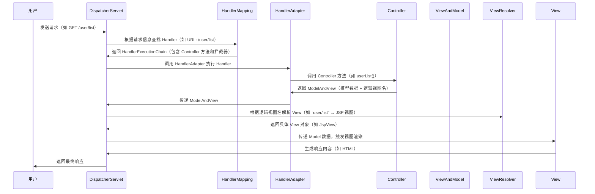

# Spring MVC 工作原理详解


## 一、核心概念

Spring MVC 是 Spring 框架的 Web 层解决方案，基于 **MVC 模式**设计，通过清晰的组件分工实现请求处理、业务逻辑和视图渲染的解耦。其核心思想是通过 **前端控制器（DispatcherServlet）** 统一调度各组件，完成从请求接收到响应返回的全流程。


## 二、核心组件与职责

Spring MVC 的核心组件及其职责如下：

| 组件名称                | 职责描述                                                                 |
|-------------------------|--------------------------------------------------------------------------|
| **DispatcherServlet**   | 前端控制器，请求的统一入口。协调所有组件完成请求处理。                     |
| **HandlerMapping**      | 请求映射器。根据请求 URL、HTTP 方法等信息，匹配对应的处理器（如 Controller 方法）。 |
| **HandlerAdapter**      | 处理器适配器。将 DispatcherServlet 传递的请求适配到具体的处理器执行（如调用 `@RequestMapping` 方法）。 |
| **Controller**          | 业务处理器。处理具体请求，调用 Service 层获取数据，返回 `ModelAndView`（包含模型数据和视图信息）。 |
| **ModelAndView**        | 数据传输对象。`Model` 存储业务数据，`View` 存储逻辑视图名（如 `"user/list"`）。 |
| **ViewResolver**        | 视图解析器。将逻辑视图名解析为具体的 `View` 对象（如 JSP、Thymeleaf 模板）。 |
| **View**                | 视图渲染器。根据 `Model` 数据生成最终响应内容（如 HTML、JSON、PDF 等）。 |


## 三、完整工作流程（含流程图）


### 1. 整体流程图（Mermaid 绘制）




### 2. 流程步骤详解（从请求到响应）

#### 步骤 1：用户发送请求  
用户通过浏览器发送 HTTP 请求（如 `GET /user/list`），请求被服务器接收后，由 **Servlet 容器**（如 Tomcat）转发给 `DispatcherServlet`（需在 `web.xml` 中配置其拦截所有请求）。


#### 步骤 2：DispatcherServlet 查找 Handler  
DispatcherServlet 调用 **HandlerMapping**（默认是 `RequestMappingHandlerMapping`），根据请求的 URL、HTTP 方法、请求头信息等，找到对应的 **Handler**（即处理该请求的 Controller 方法），并返回 `HandlerExecutionChain`（包含 Handler 和拦截器链）。

**示例**：请求 URL 为 `/user/list`，HandlerMapping 会匹配到 `@GetMapping("/user/list")` 注解的 `UserController#list()` 方法。


#### 步骤 3：执行拦截器前置逻辑  
`HandlerExecutionChain` 中的 **前置拦截器**（实现 `HandlerInterceptor#preHandle()`）会在 Handler 执行前触发（如登录校验、日志记录）。若任一拦截器返回 `false`，请求流程终止（如未登录时跳转到登录页）。


#### 步骤 4：HandlerAdapter 执行 Handler  
DispatcherServlet 通过 **HandlerAdapter**（默认是 `RequestMappingHandlerAdapter`）调用具体的 Handler（Controller 方法）。HandlerAdapter 的作用是统一处理不同类型的 Handler（如注解驱动的 `@RequestMapping` 方法、传统的 `HttpRequestHandler`）。


#### 步骤 5：Controller 处理业务逻辑  
Controller 方法（如 `UserController#list()`）执行以下操作：  
- 调用 Service 层获取数据（如 `List<User> users = userService.getAllUsers()`）；  
- 将数据存入 `Model`（如 `model.addAttribute("users", users)`）；  
- 返回逻辑视图名（如 `return "user/list"`）或直接返回数据（如 `@ResponseBody` 返回 JSON）。  


#### 步骤 6：返回 ModelAndView  
Controller 方法执行完成后，返回 `ModelAndView` 对象（或通过 `@ResponseBody` 返回数据），由 HandlerAdapter 传递给 DispatcherServlet。


#### 步骤 7：视图解析器解析视图  
DispatcherServlet 调用 **ViewResolver**（如 `InternalResourceViewResolver` 或 `ThymeleafViewResolver`），将逻辑视图名（如 `"user/list"`）解析为具体的 `View` 对象（如 JSP 视图 `WEB-INF/views/user/list.jsp` 或 Thymeleaf 模板）。


#### 步骤 8：执行拦截器后置逻辑  
`HandlerExecutionChain` 中的 **后置拦截器**（实现 `HandlerInterceptor#postHandle()`）会在 Handler 执行后、视图渲染前触发（如添加公共模型数据）。


#### 步骤 9：视图渲染生成响应  
View 对象（如 JSP、Thymeleaf 模板或 JSON 序列化器）利用 `Model` 中的数据渲染响应内容：  
- 对于 HTML 视图：将模型数据填充到模板中生成 HTML；  
- 对于 JSON 响应：将 Java 对象序列化为 JSON 字符串；  
- 对于文件下载：生成二进制流响应。  


#### 步骤 10：执行拦截器完成逻辑  
最后，**完成拦截器**（实现 `HandlerInterceptor#afterCompletion()`）会在视图渲染完成后触发（如清理资源、记录耗时日志）。


#### 步骤 11：返回响应给用户  
DispatcherServlet 将最终的响应内容（如 HTML、JSON）返回给用户浏览器，完成整个请求处理流程。


## 四、关键配置示例


### 1. web.xml 配置 DispatcherServlet（传统 XML 方式）  
需在 `web.xml` 中配置 `DispatcherServlet` 作为前端控制器，并指定其拦截所有请求：

```xml
<!-- web.xml -->
<web-app>
    <!-- 配置 DispatcherServlet -->
    <servlet>
        <servlet-name>springmvc</servlet-name>
        <servlet-class>org.springframework.web.servlet.DispatcherServlet</servlet-class>
        <!-- 指定 Spring MVC 配置文件位置（默认：/WEB-INF/{servlet-name}-servlet.xml） -->
        <init-param>
            <param-name>contextConfigLocation</param-name>
            <param-value>classpath:springmvc.xml</param-value>
        </init-param>
        <load-on-startup>1</load-on-startup> <!-- 启动时初始化 -->
    </servlet>

    <!-- 映射所有请求到 DispatcherServlet（除静态资源外） -->
    <servlet-mapping>
        <servlet-name>springmvc</servlet-name>
        <url-pattern>/</url-pattern>
    </servlet-mapping>
</web-app>
```


### 2. springmvc.xml 核心配置  
Spring MVC 配置文件需声明组件扫描、视图解析器、静态资源处理等：

```xml
<!-- springmvc.xml -->
<beans xmlns="http://www.springframework.org/schema/beans"
       xmlns:mvc="http://www.springframework.org/schema/mvc"
       xmlns:context="http://www.springframework.org/schema/context"
       xsi:schemaLocation="...">

    <!-- 1. 扫描 Controller 所在包 -->
    <context:component-scan base-package="com.example.controller"/>

    <!-- 2. 配置视图解析器（JSP 示例） -->
    <bean class="org.springframework.web.servlet.view.InternalResourceViewResolver">
        <property name="prefix" value="/WEB-INF/views/"/>  <!-- 视图文件前缀 -->
        <property name="suffix" value=".jsp"/>             <!-- 视图文件后缀 -->
    </bean>

    <!-- 3. 启用注解驱动（自动配置 HandlerMapping、HandlerAdapter 等） -->
    <mvc:annotation-driven/>

    <!-- 4. 静态资源处理（如 CSS/JS/图片） -->
    <mvc:resources mapping="/static/**" location="/static/"/>
</beans>
```


## 五、关键扩展点


### 1. 拦截器（Interceptor）  
通过实现 `HandlerInterceptor` 接口，可在请求处理的不同阶段添加自定义逻辑（如登录校验、日志记录）：

```java
import org.springframework.web.servlet.HandlerInterceptor;
import javax.servlet.http.HttpServletRequest;
import javax.servlet.http.HttpServletResponse;

public class LoginInterceptor implements HandlerInterceptor {
    // 前置处理（请求到达 Controller 前执行）
    @Override
    public boolean preHandle(HttpServletRequest request, 
                             HttpServletResponse response, 
                             Object handler) throws Exception {
        // 校验用户是否登录（如 Session 中是否有用户信息）
        if (request.getSession().getAttribute("user") == null) {
            response.sendRedirect("/login"); // 未登录则跳转登录页
            return false; // 阻止请求继续传递
        }
        return true; // 允许请求继续传递
    }

    // 后置处理（Controller 执行后，视图渲染前执行）
    @Override
    public void postHandle(HttpServletRequest request, 
                           HttpServletResponse response, 
                           Object handler, 
                           ModelAndView modelAndView) throws Exception {
        // 添加公共模型数据（如全局导航菜单）
        modelAndView.addObject("menu", getGlobalMenu());
    }

    // 完成处理（视图渲染后执行）
    @Override
    public void afterCompletion(HttpServletRequest request, 
                                HttpServletResponse response, 
                                Object handler, 
                                Exception ex) throws Exception {
        // 清理资源（如关闭数据库连接）
    }
}
```

**配置拦截器**（在 `springmvc.xml` 中）：

```xml
<mvc:interceptors>
    <mvc:interceptor>
        <!-- 拦截所有 /user/** 的请求 -->
        <mvc:mapping path="/user/**"/>
        <bean class="com.example.interceptor.LoginInterceptor"/>
    </mvc:interceptor>
</mvc:interceptors>
```


### 2. 自定义视图解析器  
若需支持自定义视图（如 PDF、Excel），可通过实现 `ViewResolver` 接口自定义视图解析逻辑：

```java
import org.springframework.web.servlet.View;
import org.springframework.web.servlet.ViewResolver;
import java.util.Locale;

public class PdfViewResolver implements ViewResolver {
    @Override
    public View resolveViewName(String viewName, Locale locale) throws Exception {
        if (viewName.startsWith("pdf:")) {
            return new PdfView(); // 自定义 PdfView 实现视图渲染
        }
        return null; // 其他视图由其他解析器处理
    }
}
```

**配置自定义视图解析器**（在 `springmvc.xml` 中）：

```xml
<bean class="com.example.resolver.PdfViewResolver"/>
```


## 六、总结

Spring MVC 的核心流程可概括为“**一核心（DispatcherServlet）、六组件（HandlerMapping、HandlerAdapter 等）、十步骤（从请求到响应）**”。理解其工作原理需重点掌握：  
- 各组件的职责及交互顺序（如 HandlerMapping 找处理器、ViewResolver 解析视图）；  
- 请求处理的完整路径（用户 → DispatcherServlet → Controller → View → 用户）；  
- 扩展点（拦截器、自定义视图）的应用场景。  

通过本文的流程图和步骤解析，可清晰掌握 Spring MVC 从请求接收到响应返回的全流程。