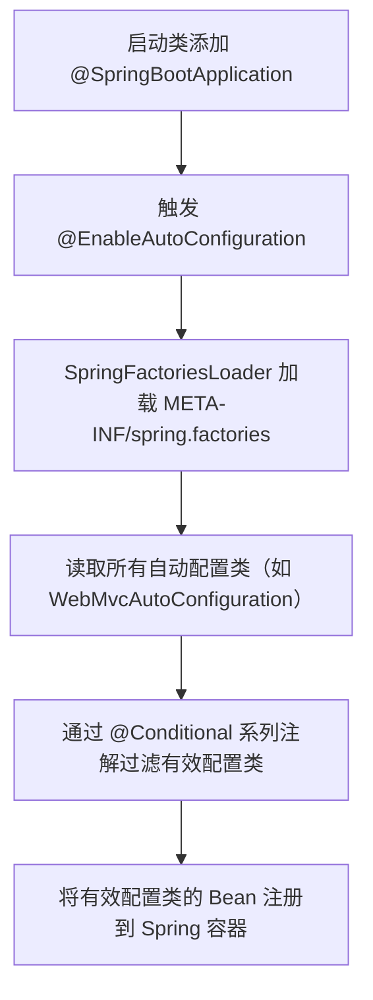
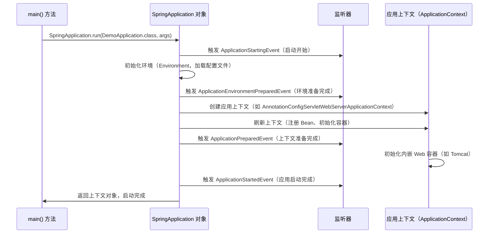

# Spring Boot 核心面试知识点笔记  


## 一、对 Spring Boot 的简单理解  


### 1. 定义与目标  
Spring Boot 是 Spring 生态的**快速开发框架**，通过“**约定大于配置**”（Convention Over Configuration）的理念，解决了传统 Spring 项目**配置繁琐、依赖管理复杂**的问题。其核心目标是：  
- **简化开发**：内置默认配置，减少 XML/Java 配置代码；  
- **开箱即用**：通过 Starter 依赖自动装配常用功能（如 Spring MVC、MyBatis）；  
- **内嵌容器**：内置 Tomcat/Jetty 等 Web 容器，无需独立部署；  
- **生产友好**：提供 Actuator 监控、健康检查等生产级功能。  


### 2. 核心优势对比传统 Spring  
| 特性                | 传统 Spring                          | Spring Boot                          |  
|---------------------|--------------------------------------|--------------------------------------|  
| 配置复杂度          | 大量 XML/Java 配置（如事务、MVC）    | 自动装配 + 少量 `application.properties` 配置 |  
| 依赖管理            | 手动协调依赖版本（易冲突）           | Starter 统一管理依赖（版本兼容）     |  
| 部署方式            | 需外部 Web 容器（如 Tomcat）         | 内嵌容器（`java -jar` 直接运行）      |  
| 监控与维护          | 需手动集成（如 JMX、日志）           | Actuator 内置监控（HTTP 端点）       |  


## 二、核心注解  


### 1. 启动类注解：`@SpringBootApplication`  
Spring Boot 启动类的核心注解，是以下 3 个注解的组合：  

| 子注解                | 作用                                                                 |  
|-----------------------|----------------------------------------------------------------------|  
| `@SpringBootConfiguration` | 等价于 `@Configuration`，声明当前类是配置类（可替换为 `@Configuration`） |  
| `@ComponentScan`       | 扫描当前包及其子包下的 `@Component`、`@Service` 等注解类，注入容器       |  
| `@EnableAutoConfiguration` | 触发**自动装配**机制，加载 Spring Boot 内置的自动配置类                |  


**示例：启动类代码**  
```java
@SpringBootApplication // 组合注解，包含上述 3 个注解
public class DemoApplication {
    public static void main(String[] args) {
        SpringApplication.run(DemoApplication.class, args); // 启动 Spring Boot
    }
}
```  


### 2. 自动装配相关注解  
| 注解                  | 作用                                                                 | 示例                                                                 |  
|-----------------------|----------------------------------------------------------------------|----------------------------------------------------------------------|  
| `@EnableAutoConfiguration` | 启用自动装配，加载 `META-INF/spring.factories` 中的自动配置类          | `@SpringBootApplication` 已包含此注解                                |  
| `@Conditional`         | 条件装配（核心注解，支持多种子注解）                                 | `@ConditionalOnClass(WebMvcConfigurer.class)`：当类路径存在该类时装配 |  
| `@ConditionalOnClass`  | 当类路径中存在指定类时，装配当前配置类                               | `@ConditionalOnClass(DataSource.class)`：存在 DataSource 时生效       |  
| `@ConditionalOnMissingBean` | 当容器中不存在指定 Bean 时，装配当前 Bean                            | `@ConditionalOnMissingBean(MyService.class)`：无 MyService 时创建     |  


### 3. 配置与依赖注入注解  
| 注解                  | 作用                                                                 | 示例                                                                 |  
|-----------------------|----------------------------------------------------------------------|----------------------------------------------------------------------|  
| `@Configuration`       | 声明配置类（等价于传统 Spring 的 XML 配置文件）                      | `@Configuration public class AppConfig { ... }`                      |  
| `@Bean`                | 在配置类中声明一个 Bean（替代 XML 的 `<bean>` 标签）                  | `@Bean public DataSource dataSource() { ... }`                      |  
| `@Value`               | 从配置文件（`application.properties`）中读取值                       | `@Value("${server.port}") private int port;`                         |  
| `@ConfigurationProperties` | 将配置文件中的属性绑定到 Java 对象（需 `@EnableConfigurationProperties` 启用） | `@ConfigurationProperties(prefix = "spring.datasource")`             |  


## 三、自动装配的原理  


### 1. 核心流程（流程图）  



### 2. 关键步骤详解  


#### 步骤 1：`@EnableAutoConfiguration` 触发自动装配  
`@SpringBootApplication` 包含 `@EnableAutoConfiguration`，该注解通过 `@Import(AutoConfigurationImportSelector.class)` 导入自动配置选择器，启动自动装配流程。  


#### 步骤 2：加载 `META-INF/spring.factories`  
`AutoConfigurationImportSelector` 调用 `SpringFactoriesLoader` 读取所有 JAR 包中的 `META-INF/spring.factories` 文件，获取 `EnableAutoConfiguration` 类型的自动配置类列表。  

**示例 `spring.factories` 内容**（部分）：  
```properties
# 自动配置类列表
org.springframework.boot.autoconfigure.EnableAutoConfiguration=\
org.springframework.boot.autoconfigure.web.servlet.WebMvcAutoConfiguration,\
org.springframework.boot.autoconfigure.jdbc.DataSourceAutoConfiguration
```  


#### 步骤 3：通过 `@Conditional` 过滤配置类  
并非所有自动配置类都会生效，需通过 `@Conditional` 系列注解判断是否满足条件（如类路径是否存在某类、容器中是否已有某 Bean）。  

**示例：WebMvcAutoConfiguration 的条件**  
```java
@Configuration
@ConditionalOnClass(WebMvcConfigurer.class) // 类路径存在 WebMvcConfigurer 时生效
@ConditionalOnMissingBean(WebMvcConfigurationSupport.class) // 容器中无 WebMvcConfigurationSupport 时生效
public class WebMvcAutoConfiguration { ... }
```  


#### 步骤 4：注册有效配置类的 Bean  
过滤后的自动配置类会被解析，其中的 `@Bean` 方法定义的组件会被注册到 Spring 容器中（如 `WebMvcAutoConfiguration` 会注册 `RequestMappingHandlerMapping`、`ViewResolver` 等 Bean）。  


### 3. 自定义自动配置（代码示例）  
若需为自定义组件实现自动装配，需：  
1. 编写配置类并添加 `@Configuration` 和 `@Conditional` 注解；  
2. 在 `src/main/resources/META-INF/spring.factories` 中注册该配置类。  


**步骤 1：编写配置类**  
```java
// 自定义配置类
@Configuration
@ConditionalOnClass(MyService.class) // 当类路径存在 MyService 时生效
@ConditionalOnProperty(prefix = "my.service", name = "enabled", havingValue = "true") // 配置 my.service.enabled=true 时生效
public class MyServiceAutoConfiguration {

    @Bean
    @ConditionalOnMissingBean // 容器中无 MyService 时创建
    public MyService myService() {
        return new MyService();
    }
}
```  


**步骤 2：注册到 `spring.factories`**  
```properties
# META-INF/spring.factories
org.springframework.boot.autoconfigure.EnableAutoConfiguration=\
com.example.config.MyServiceAutoConfiguration
```  


## 四、启动原理  


### 1. 启动流程（时序图）  



### 2. 关键步骤详解  


#### 步骤 1：`SpringApplication.run()` 启动入口  
启动类的 `main` 方法调用 `SpringApplication.run()`，该方法完成以下操作：  
- 创建 `SpringApplication` 对象（封装启动逻辑）；  
- 执行 `run()` 方法，触发启动流程。  


#### 步骤 2：初始化环境（Environment）  
加载系统属性、环境变量、`application.properties` 等配置，构建 `Environment` 对象（存储所有配置信息）。  


#### 步骤 3：创建应用上下文（ApplicationContext）  
根据项目类型（Web/非 Web）创建不同的上下文：  
- Web 项目：`AnnotationConfigServletWebServerApplicationContext`（内嵌 Tomcat）；  
- 非 Web 项目：`AnnotationConfigApplicationContext`（无 Web 容器）。  


#### 步骤 4：刷新上下文（`refresh()`）  
调用 `AbstractApplicationContext#refresh()`，完成以下核心操作：  
- 注册 Bean 定义（扫描 `@Component`、自动配置类等）；  
- 实例化所有单例 Bean（包括自动装配的 Bean）；  
- 初始化内嵌 Web 容器（如启动 Tomcat，绑定端口）。  


#### 步骤 5：触发启动完成事件  
上下文刷新完成后，触发 `ApplicationStartedEvent`，标志应用启动成功。  


### 3. 启动类 `main` 方法简化原理  
Spring Boot 通过 `@SpringBootApplication` 和 `SpringApplication.run()` 隐藏了传统 Spring 的复杂启动逻辑。例如，传统 Spring MVC 需要：  
```java
// 传统 Spring MVC 启动方式（需手动创建上下文）
public static void main(String[] args) {
    ApplicationContext context = new ClassPathXmlApplicationContext("applicationContext.xml");
    // 手动启动 Web 容器（如 Tomcat）
}
```  
而 Spring Boot 通过 `SpringApplication.run()` 自动完成了上下文创建、Web 容器启动等操作。  


## 五、总结  


### 面试高频问题总结  
1. **Spring Boot 如何简化开发？**  
   答：通过自动装配（`@EnableAutoConfiguration`）、Starter 依赖管理、内嵌容器、`application.properties` 简化配置。  

2. **自动装配的核心原理？**  
   答：通过 `@EnableAutoConfiguration` 触发，加载 `META-INF/spring.factories` 中的自动配置类，再通过 `@Conditional` 系列注解过滤有效配置类，最终将 Bean 注册到容器。  

3. **启动类 `@SpringBootApplication` 包含哪些注解？**  
   答：`@SpringBootConfiguration`（配置类）、`@ComponentScan`（组件扫描）、`@EnableAutoConfiguration`（自动装配）。  

4. **Spring Boot 启动流程的关键步骤？**  
   答：初始化环境 → 创建应用上下文 → 刷新上下文（注册 Bean、启动内嵌容器）→ 触发启动完成事件。  


通过本文的梳理，可清晰掌握 Spring Boot 的核心机制，应对面试中的高频问题。