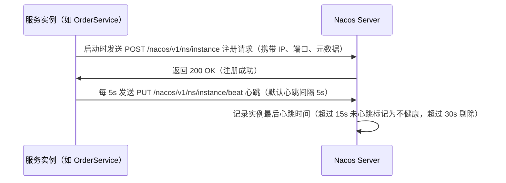
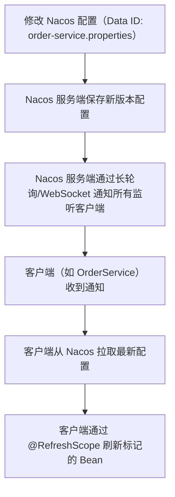

# Spring Cloud Nacos 核心面试知识点笔记  


## 一、Nacos 核心定位与优势  


### 1. 基础概念  
Nacos（**Na**ming **Co**nfiguration **S**ervice）是阿里巴巴开源的分布式注册中心与配置中心一体化解决方案，支持 **服务发现、服务健康监测、动态配置管理、服务及元数据管理** 四大核心功能。  


### 2. 核心优势对比  
| 特性                | Nacos                                   | Eureka（传统注册中心）              | Spring Cloud Config（传统配置中心） |  
|---------------------|-----------------------------------------|-------------------------------------|-------------------------------------|  
| 功能定位            | 注册中心 + 配置中心 一体化              | 仅注册中心                          | 仅配置中心                          |  
| 一致性模式          | 支持 AP（默认）/ CP 模式（可切换）       | AP（可用优先）                      | 无（依赖 Git 一致性）               |  
| 健康检查            | 服务端主动检查 + 客户端心跳             | 仅客户端心跳（30s 一次）            | 无（需手动刷新）                    |  
| 配置管理            | 支持动态推送、版本回滚、多环境隔离      | 无                                  | 依赖 Git 存储，需手动触发刷新        |  


## 二、Nacos 作为注册中心  


### 1. 核心概念与术语  
| 术语                | 说明                                                                 |  
|---------------------|----------------------------------------------------------------------|  
| **服务（Service）** | 逻辑上的服务实体（如 `order-service`、`product-service`）              |  
| **实例（Instance）**| 服务的具体运行实例（如某台机器上的 `order-service:8080`）            |  
| **健康检查**        | Nacos 服务端定期检查实例状态（如 HTTP/TCP 检查、客户端心跳）            |  
| **元数据（Metadata）** | 实例的附加信息（如版本、环境、权重），用于自定义路由规则               |  


### 2. 服务注册流程（时序图）  



### 3. 服务发现流程（客户端拉取模式）  
客户端通过 Nacos SDK 定期拉取服务实例列表（默认 30s 拉取一次），或监听服务变化事件实时更新。  


#### 代码示例：服务发现（Spring Cloud）  
```java
@Service
public class OrderService {
    @Autowired
    private NacosDiscoveryProperties discoveryProperties; // Nacos 配置
    @Autowired
    private RestTemplate restTemplate;

    public String getProductInfo() {
        // 1. 从 Nacos 获取 "product-service" 的所有健康实例
        List<ServiceInstance> instances = discoveryProperties.namingService()
            .selectInstances("product-service", true); // true 表示仅健康实例
        
        // 2. 负载均衡（示例用轮询）
        ServiceInstance instance = instances.get(0);
        String url = "http://" + instance.getHost() + ":" + instance.getPort() + "/product";
        
        // 3. 调用远程服务
        return restTemplate.getForObject(url, String.class);
    }
}
```  


### 4. 心跳与健康检查机制  
| 机制                | 说明                                                                 | 默认参数                          |  
|---------------------|----------------------------------------------------------------------|-----------------------------------|  
| **客户端心跳**       | 实例主动向 Nacos 发送心跳（HTTP/PUT 请求）                            | 心跳间隔 5s，超时 30s 剔除实例     |  
| **服务端主动检查**   | Nacos 服务端对实例发起 HTTP/TCP 检查（适用于无心跳能力的实例）        | HTTP 检查路径 `/actuator/health`   |  


### 5. 集群同步机制（AP/CP 模式）  
Nacos 支持两种一致性模式，通过 `nacos.core.auth.cp-mode` 配置切换：  


#### （1）AP 模式（默认）  
- **一致性协议**：使用 `Distro` 协议（分布式哈希分区）；  
- **特点**：高可用优先，允许短暂数据不一致；  
- **适用场景**：服务发现（允许实例列表短暂不同步）。  


#### （2）CP 模式  
- **一致性协议**：使用 `Raft` 协议（强一致性）；  
- **特点**：强一致性，leader 选举期间不可写；  
- **适用场景**：配置管理（需严格保证配置一致）。  


## 三、Nacos 作为配置中心  


### 1. 核心概念与术语  
| 术语                | 说明                                                                 |  
|---------------------|----------------------------------------------------------------------|  
| **Data ID**         | 配置文件的唯一标识（如 `order-service-dev.properties`）              |  
| **Group**           | 配置分组（如 `DEFAULT_GROUP`、`PROD_GROUP`）                          |  
| **Namespace**       | 环境隔离（如 `dev`、`test`、`prod`）                                  |  
| **配置版本**        | 每次配置变更生成新版本，支持回滚                                      |  


### 2. 配置存储结构  
Nacos 配置按 `Namespace → Group → Data ID` 三级结构存储，示例：  
```
Namespace: dev  
└─ Group: DEFAULT_GROUP  
   └─ Data ID: order-service.properties  
      ├─ key: server.port  
      └─ value: 8080  
```  


### 3. 配置热更新原理（流程图）  



### 4. 配置热更新代码示例  


#### （1）依赖配置（pom.xml）  
```xml
<dependency>
    <groupId>com.alibaba.cloud</groupId>
    <artifactId>spring-cloud-starter-alibaba-nacos-config</artifactId>
</dependency>
```  


#### （2）bootstrap.properties（配置源）  
```properties
# 配置中心地址
spring.cloud.nacos.config.server-addr=127.0.0.1:8848
# 环境隔离（Namespace ID）
spring.cloud.nacos.config.namespace=dev
# Data ID（格式：${prefix}-${spring.profile.active}.${file-extension}）
spring.cloud.nacos.config.prefix=order-service
spring.cloud.nacos.config.file-extension=properties
```  


#### （3）动态刷新配置（@RefreshScope）  
```java
@RefreshScope // 标记该 Bean 支持配置动态刷新
@Service
public class ConfigService {
    @Value("${server.port}") // 从 Nacos 读取配置
    private int port;

    public String getConfig() {
        return "当前端口配置：" + port;
    }
}
```  


### 5. 配置监听（编程式）  
通过 `NacosConfigListener` 手动监听配置变更，适用于需要自定义处理逻辑的场景：  

```java
@Autowired
private ConfigService configService; // Nacos 配置服务

@PostConstruct
public void init() throws NacosException {
    // 监听 Data ID 为 "order-service.properties" 的配置变更
    configService.addListener("order-service.properties", "DEFAULT_GROUP", new Listener() {
        @Override
        public void receiveConfigInfo(String configInfo) {
            // 配置变更时触发（如重新加载加密配置）
            System.out.println("配置已变更：" + configInfo);
        }

        @Override
        public Executor getExecutor() {
            return null; // 使用默认线程池
        }
    });
}
```  


## 四、高频面试问题总结  


### 1. Nacos 作为注册中心，如何保证服务实例的健康状态？  
答：通过 **客户端心跳**（实例每 5s 发送心跳）和 **服务端主动检查**（对无心跳实例发起 HTTP/TCP 检查）。超过 15s 无心跳标记为不健康，超过 30s 剔除实例。  


### 2. Nacos 的 AP 模式与 CP 模式有什么区别？  
答：  
- **AP 模式**（默认）：使用 Distro 协议，高可用优先，允许短暂数据不一致，适用于服务发现；  
- **CP 模式**：使用 Raft 协议，强一致性优先，leader 选举期间不可写，适用于配置管理。  


### 3. Nacos 配置热更新的原理是什么？  
答：  
1. Nacos 服务端保存配置并记录版本；  
2. 客户端通过长轮询（默认 30s）或 WebSocket 监听配置变更；  
3. 配置变更时，服务端通知客户端拉取最新配置；  
4. 客户端通过 `@RefreshScope` 重新初始化标记的 Bean，实现配置热更新。  


### 4. 如何实现 Nacos 配置的多环境隔离？  
答：通过 **Namespace** 隔离不同环境（如 `dev`、`test`、`prod`），每个 Namespace 可独立管理配置，避免环境配置混用。  


### 5. Nacos 相比 Eureka 的优势？  
答：  
- 一体化：同时支持注册中心和配置中心；  
- 健康检查更灵活：支持服务端主动检查；  
- 一致性模式可选：AP/CP 模式按需切换；  
- 配置管理更强大：支持动态推送、版本回滚、多环境隔离。  


通过本文的梳理，可系统掌握 Nacos 作为注册中心和配置中心的核心机制，应对面试中的深度提问。