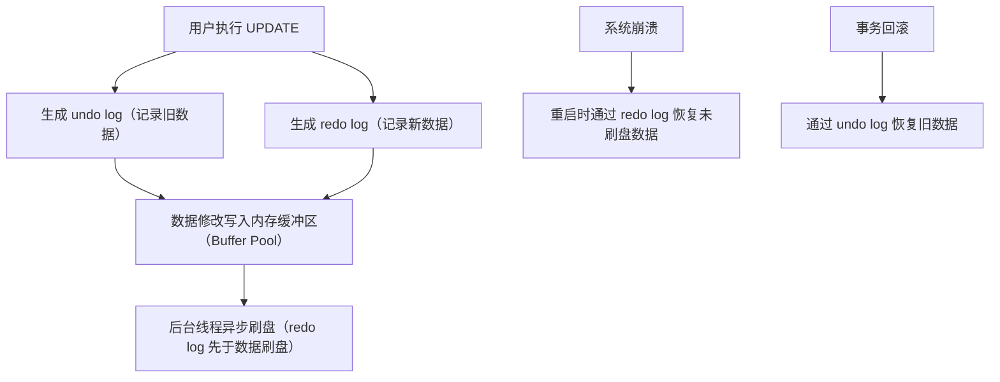

# 关系型数据库核心面试知识点笔记  


## 一、MySQL vs PostgreSQL 对比  


### 1. 核心定位与适用场景  
| 特性                | MySQL                                      | PostgreSQL                               |  
|---------------------|------------------------------------------|------------------------------------------|  
| **定位**            | 轻量级、高性能 OLTP 数据库（互联网首选）  | 企业级、支持复杂业务逻辑的通用数据库     |  
| **适用场景**        | 高并发读写、电商/社交类业务（如订单、用户表） | 金融/政务/数据分析（需复杂 SQL、事务强一致） |  
| **数据类型**        | 支持基础类型 + 部分扩展（如 JSON）         | 支持复杂类型（数组、枚举、JSONB、几何类型） |  
| **事务特性**        | InnoDB 支持 ACID，默认隔离级别 RR          | 全功能 ACID，支持更细粒度锁（行级锁默认） |  
| **扩展性**          | 依赖中间件（如 MyCat）实现分库分表         | 内置 CTE、窗口函数、自定义函数（扩展性强）|  


### 2. 关键差异对比  
#### （1）数据类型  
| MySQL 特有类型       | PostgreSQL 特有类型         | 通用类型（均支持）         |  
|---------------------|-----------------------------|----------------------------|  
| `ENUM`、`SET`       | `ARRAY`、`HSTORE`、`JSONB`  | `INT`、`VARCHAR`、`DATE`   |  
| `AUTO_INCREMENT`    | `SERIAL`（自增序列）         | `BLOB`、`TEXT`             |  

#### （2）事务隔离级别  
| 隔离级别            | MySQL（InnoDB）             | PostgreSQL                 |  
|---------------------|-----------------------------|----------------------------|  
| **读未提交**        | 支持                          | 支持                       |  
| **读已提交**        | 支持（默认 RR，可切换）       | 支持（默认 RC）            |  
| **可重复读**        | 默认隔离级别                 | 支持                       |  
| **串行化**          | 支持                          | 支持                       |  

#### （3）存储引擎  
| MySQL                 | PostgreSQL                   |  
|---------------------|-----------------------------|  
| 多引擎架构（InnoDB/MyISAM 等） | 单引擎架构（内核集成存储逻辑）|  
| 默认引擎 InnoDB（支持事务）   | 默认引擎 Heap（内存表）？No！默认是事务安全的存储引擎，实际PostgreSQL没有存储引擎的概念，其存储引擎是内置的，支持事务和复杂特性。|  


### 3. 高频面试问题  
**Q：何时选择 PostgreSQL 而非 MySQL？**  
A：  
1. 需要支持复杂数据类型（如数组、JSONB）；  
2. 复杂查询场景（CTE、窗口函数、全文搜索）；  
3. 强事务一致性要求（如金融转账、分布式事务）；  
4. 需自定义函数/存储过程实现业务逻辑。  


## 二、ACID 特性详解  


### 1. 四大特性定义  
| 特性   | 定义                                                                 | 实现机制                                                             |  
|--------|----------------------------------------------------------------------|----------------------------------------------------------------------|  
| **原子性（Atomicity）** | 事务中操作要么全成功，要么全回滚                                     | `undo log`（记录事务修改前的数据，回滚时恢复）                      |  
| **一致性（Consistency）** | 事务执行后数据符合业务规则（如转账前后总额不变）                     | 主键约束、外键约束、事务日志（redo/undo）                            |  
| **隔离性（Isolation）** | 多事务并发时互不干扰                                                 | 锁机制（行锁/表锁）、MVCC（多版本并发控制，如 InnoDB 的版本链）       |  
| **持久性（Durability）** | 事务提交后数据永久保存                                               | `redo log`（预写日志，先写日志再写磁盘）                            |  


### 2. 事务隔离级别与问题  
#### （1）隔离级别导致的问题  
| 隔离级别       | 脏读 | 不可重复读 | 幻读 |  
|----------------|------|------------|------|  
| 读未提交（RC=0） | 允许 | 允许       | 允许 |  
| 读已提交（RC=1，PostgreSQL 默认） | 禁止 | 允许       | 允许 |  
| 可重复读（RR=2，MySQL 默认） | 禁止 | 禁止       | 允许（InnoDB 通过 MVCC 解决） |  
| 串行化（Serializable=3） | 禁止 | 禁止       | 禁止 |  

#### （2）MySQL InnoDB 的 MVCC 实现  
- **版本链**：每行数据存储多个版本（通过隐藏字段 `trx_id`、`roll_ptr`）；  
- **Read View**：事务查询时生成当前活跃事务列表，根据版本链判断数据可见性；  
- **解决问题**：在 RR 隔离级别下，避免脏读和不可重复读，通过间隙锁（Gap Lock）解决幻读。  


### 3. 代码示例：事务操作  
```sql
-- MySQL/PostgreSQL 通用事务语法
BEGIN TRANSACTION;  -- 开启事务
UPDATE account SET balance = balance - 100 WHERE id = 1;  -- 扣款
UPDATE account SET balance = balance + 100 WHERE id = 2;  -- 收款
COMMIT;  -- 提交事务（所有操作生效）

-- 异常回滚
BEGIN TRANSACTION;
UPDATE stock SET count = count - 1 WHERE product_id = 1;
IF ERROR THEN
    ROLLBACK;  -- 回滚事务（数据恢复到初始状态）
END IF;
```  


## 三、MySQL 索引深度解析  


### 1. 索引本质与数据结构  
**索引**：数据库用于快速查找数据的**数据结构**（如 B+ 树、哈希表），本质是“键-值”映射。  


#### （1）B+ 树索引（最常用）  
- **结构特点**：  
  - 叶子节点存储数据指针（聚集索引存数据本身，非聚集索引存主键）；  
  - 所有查询最终定位到叶子节点（查询效率稳定，O(logN)）；  
  - 支持范围查询（如 `WHERE age > 20`）。  
- **适用场景**：全值匹配、前缀匹配、范围查询。  

#### （2）哈希索引  
- **结构特点**：  
  - 通过哈希函数计算键的哈希值，存储在哈希表中；  
  - 等值查询快（O(1)），不支持范围查询。  
- **适用场景**：高频等值查询（如缓存场景的主键查询）。  


### 2. 索引分类  
| 类型            | 定义                                                                 | 示例                                                               |  
|-----------------|----------------------------------------------------------------------|--------------------------------------------------------------------|  
| **聚集索引**    | 叶子节点存储整行数据（InnoDB 主键索引默认是聚集索引）                | `PRIMARY KEY (id)`                                                |  
| **非聚集索引**  | 叶子节点存储主键值（需回表查询完整数据）                             | `INDEX idx_name (name)`                                             |  
| **联合索引**    | 多个字段组合的索引（遵循“最左匹配”原则）                             | `INDEX idx_user (name, age, email)`                                |  
| **覆盖索引**    | 索引包含查询所需所有字段（无需回表）                                 | `SELECT name, age FROM user WHERE name='Alice'`（索引包含 name+age）|  


### 3. 索引优化与失效场景  
#### （1）最左匹配原则（联合索引核心）  
- 索引 `(a, b, c)` 支持的查询条件：  
  - `a`  
  - `a + b`  
  - `a + b + c`  
- **失效场景**：`WHERE b=1`（未使用最左字段 `a`，索引失效）。  

#### （2）索引失效常见原因  
| 场景                | 示例                                                                 | 优化建议                                                           |  
|---------------------|----------------------------------------------------------------------|--------------------------------------------------------------------|  
| 字段类型转换        | `SELECT * FROM user WHERE phone = 13800138000`（phone 是 VARCHAR）     | 保持查询条件与索引字段类型一致                                     |  
| 使用函数或表达式    | `SELECT * FROM user WHERE YEAR(create_time) = 2024`                    | 改为 `CREATE INDEX idx_create_time ON user(create_time)`，查询用范围条件 |  
| 模糊查询左模糊      | `SELECT * FROM user WHERE name LIKE '%alice'`（索引失效）               | 避免左模糊，改用右模糊 `LIKE 'alice%'`（仅前缀匹配有效）           |  


### 4. 高频面试问题  
**Q：为什么 InnoDB 主键建议用自增 ID？**  
A：  
1. 自增 ID 保证索引顺序插入，避免页分裂（B+ 树节点数据有序）；  
2. 非自增 ID 可能导致随机写入，增加磁盘 IO 开销。  


## 四、MySQL 存储引擎对比  


### 1. 主流引擎特性对比  
| 特性                | InnoDB（默认）               | MyISAM                     | Memory                     |  
|---------------------|-----------------------------|----------------------------|----------------------------|  
| **事务支持**        | 支持（ACID）                | 不支持                     | 不支持                     |  
| **锁粒度**          | 行锁（高并发性能好）         | 表锁（适合读多写少）       | 表锁                       |  
| **索引类型**        | B+ 树（聚集索引+非聚集索引）  | B+ 树（非聚集索引）        | 哈希索引（默认）/B+ 树     |  
| **持久化**          | 数据写入磁盘（支持 redo/undo）| 数据写入磁盘               | 数据存储在内存（重启丢失） |  
| **适用场景**        | 高并发事务（订单、交易表）   | 只读或低并发表（日志表）   | 临时表（统计中间结果）     |  


### 2. 引擎选择建议  
- **InnoDB**：优先选择，适合所有事务场景（如电商订单、用户注册）；  
- **MyISAM**：仅用于历史数据归档表（无需事务，且读多写少）；  
- **Memory**：谨慎使用，仅用于临时计算（如实时统计，数据量小）。  


## 五、MySQL 日志文件详解  


### 1. 四大核心日志  
#### （1）错误日志（error log）  
- **作用**：记录启动、运行、关闭过程中的错误信息（如磁盘空间不足、连接失败）；  
- **查看命令**：  
  ```sql
  SHOW VARIABLES LIKE 'log_error';  -- 查看日志路径
  ```  

#### （2）二进制日志（binlog）  
- **作用**：记录所有修改数据的语句（`INSERT/UPDATE/DELETE`），用于主从复制和数据恢复；  
- **开启配置**（`my.cnf`）：  
  ```conf
  server-id=1
  log_bin=mysql-bin
  binlog_format=ROW  -- 推荐 ROW 模式（记录行数据变化，避免主从数据不一致）
  ```  
- **核心用途**：  
  - 主从复制：从库通过读取主库 binlog 实现数据同步；  
  - 基于时间点恢复：`mysqlbinlog --start-datetime="2024-01-01 00:00:00" mysql-bin.000001 | mysql -u root -p`。  

#### （3）慢查询日志（slow query log）  
- **作用**：记录执行时间超过阈值（默认 10s）的 SQL，用于性能优化；  
- **开启配置**：  
  ```conf
  slow_query_log=1
  long_query_time=2  -- 设置阈值为 2s
  slow_query_log_file=/var/log/mysql/slow.log
  ```  

#### （4）事务日志（redo log + undo log）  
| 日志       | 作用                                                                 | 存储位置               |  
|------------|----------------------------------------------------------------------|------------------------|  
| **redo log** | 保证事务持久性（预写日志，先写日志再写数据），崩溃恢复时重做未提交事务 | InnoDB 系统表空间      |  
| **undo log** | 保证事务原子性（记录数据修改前的版本），用于回滚和 MVCC               | InnoDB 回滚段         |  


### 2. 日志关系流程图  



### 3. 高频面试问题  
**Q：redo log 和 binlog 的区别？**  
A：  
- **所属引擎**：redo log 是 InnoDB 特有，binlog 是 MySQL 服务器层日志；  
- **记录内容**：redo log 记录数据页的物理修改，binlog 记录 SQL 语句（ROW 模式记录行数据）；  
- **用途**：redo log 用于崩溃恢复，binlog 用于主从复制和逻辑恢复。  


## 六、总结  
### 核心考点速记  
1. **MySQL vs PG**：前者轻量适合 OLTP，后者强大适合复杂业务；  
2. **ACID**：原子性（undo）、持久化（redo）、隔离性（锁/MVCC）；  
3. **索引**：B+ 树支持范围查询，联合索引需遵循最左匹配，避免索引失效；  
4. **存储引擎**：InnoDB 是事务首选，MyISAM 用于只读场景；  
5. **日志**：binlog 用于主从复制，redo/undo 保证事务特性。  

掌握这些知识点，可应对 90% 以上的关系型数据库面试问题。