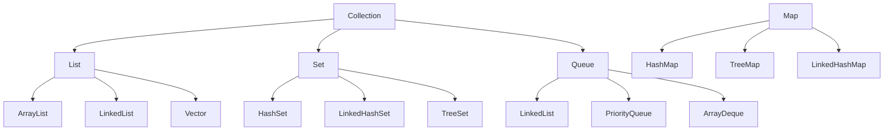

# Java 集合框架核心面试知识点笔记  


## 一、集合框架整体架构  
Java 集合框架（Java Collections Framework, JCF）分为 **Collection**（存储单元素）和 **Map**（存储键值对）两大分支，核心接口与实现类关系如下：  


### 1. 框架层级图（Mermaid 绘制）  



## 二、List 接口：有序可重复集合  


### 1. 核心实现类对比  
| 类            | 底层结构       | 线程安全 | 扩容机制                  | 时间复杂度（增删/查询） | 适用场景                  |  
|---------------|----------------|----------|---------------------------|-------------------------|---------------------------|  
| **ArrayList** | 动态数组       | 否       | 初始容量 10，扩容 1.5 倍  | 增删（O(n)）、查询（O(1)）| 随机访问多、增删少的场景  |  
| **LinkedList** | 双向链表       | 否       | 无（链表无固定容量）      | 增删（O(1)）、查询（O(n)）| 频繁增删、顺序访问的场景  |  
| **Vector**     | 动态数组       | 是（`synchronized`）| 初始容量 10，扩容 2 倍（可指定增量）| 同 ArrayList             | 需线程安全但性能要求低的场景|  


### 2. 关键源码与示例  


#### （1）ArrayList 扩容示例  
```java
// JDK 1.8 ArrayList 扩容核心代码
private void grow(int minCapacity) {
    int oldCapacity = elementData.length;
    int newCapacity = oldCapacity + (oldCapacity >> 1); // 1.5 倍扩容
    if (newCapacity - minCapacity < 0)
        newCapacity = minCapacity;
    elementData = Arrays.copyOf(elementData, newCapacity); // 数组拷贝
}

// 使用示例
ArrayList<Integer> list = new ArrayList<>();
list.add(1);  // 首次添加元素时，数组从 null 扩容为 10
list.add(2);
// 当元素超过 10 时，触发扩容为 15（10*1.5）
```  


#### （2）LinkedList 双向链表结构  
```java
// JDK 1.8 LinkedList 节点定义
private static class Node<E> {
    E item;
    Node<E> prev; // 前驱指针
    Node<E> next; // 后继指针
    Node(Node<E> prev, E element, Node<E> next) {
        this.item = element;
        this.prev = prev;
        this.next = next;
    }
}
```  


## 三、Set 接口：无序唯一集合  


### 1. 核心实现类对比  
| 类                | 底层结构               | 元素特性                  | 有序性                  | 时间复杂度（增删查） |  
|-------------------|------------------------|---------------------------|-------------------------|---------------------|  
| **HashSet**       | HashMap（键存储元素）  | 唯一（依赖 `hashCode`+`equals`）| 无序（与插入顺序无关）  | O(1)                |  
| **LinkedHashSet**  | LinkedHashMap（双向链表+哈希表）| 唯一，维护插入顺序（或访问顺序）| 有序（插入顺序）        | O(1)                |  
| **TreeSet**       | TreeMap（红黑树）      | 唯一，元素需实现 `Comparable` 或自定义 `Comparator` | 有序（自然排序/自定义排序）| O(log n)            |  


### 2. 关键特性与示例  


#### （1）HashSet 去重原理  
- **步骤**：计算元素 `hashCode` → 定位数组桶 → 若桶内链表/红黑树存在 `equals` 相等的元素则拒绝插入。  
- **注意**：若重写 `equals` 必须重写 `hashCode`（否则可能导致重复元素）。  


#### （2）TreeSet 自定义排序示例  
```java
// 按字符串长度降序排序的 TreeSet
TreeSet<String> set = new TreeSet<>((a, b) -> {
    int lenCompare = Integer.compare(b.length(), a.length());
    return lenCompare != 0 ? lenCompare : a.compareTo(b); // 长度相同则按字典序
});
set.add("apple");  // 长度 5
set.add("banana"); // 长度 6
set.add("grape");  // 长度 5
System.out.println(set); // 输出 [banana, apple, grape]（按长度降序）
```  


## 四、Queue 接口：队列与双端队列  


### 1. 核心实现类对比  
| 类                | 底层结构       | 特性                                  | 适用场景                  |  
|-------------------|----------------|---------------------------------------|---------------------------|  
| **LinkedList**    | 双向链表       | 支持 `Queue`（FIFO）和 `Deque`（双端）| 简单队列/双端队列场景     |  
| **PriorityQueue** | 小根堆（数组） | 按自然顺序或 `Comparator` 排序的优先队列 | 任务调度（如优先级高的先执行）|  
| **ArrayDeque**    | 循环数组       | 双端队列，无容量限制（动态扩容）      | 高效的双端操作（替代 `Stack`）|  


### 2. 关键方法对比（Queue vs Deque）  
| 操作类型         | 抛出异常（Queue） | 返回特殊值（Queue） | 双端操作（Deque）          |  
|------------------|-------------------|---------------------|----------------------------|  
| 插入队首/队尾     | `addFirst()`/`addLast()` | `offerFirst()`/`offerLast()` | 双端插入                   |  
| 删除队首/队尾     | `removeFirst()`/`removeLast()` | `pollFirst()`/`pollLast()` | 双端删除                   |  
| 查看队首/队尾     | `getFirst()`/`getLast()` | `peekFirst()`/`peekLast()` | 双端查看                   |  


## 五、Map 接口：键值对集合  


### 1. 核心实现类对比  
| 类                   | 底层结构               | 线程安全 | 有序性                  | 时间复杂度（增删查） | 特性                                  |  
|----------------------|------------------------|----------|-------------------------|---------------------|---------------------------------------|  
| **HashMap**          | 数组+链表+红黑树（JDK 1.8+）| 否       | 无序                    | O(1)（平均）        | 允许 `null` 键值，初始容量 16，负载因子 0.75 |  
| **LinkedHashMap**    | 哈希表+双向链表        | 否       | 插入顺序/访问顺序        | O(1)                | 可实现 LRU 缓存（`accessOrder=true`）  |  
| **TreeMap**          | 红黑树                 | 否       | 键的自然排序/自定义排序  | O(log n)            | 支持范围查询（如 `subMap()`）          |  
| **Hashtable**        | 数组+链表              | 是（`synchronized`）| 无序                    | O(1)                | 不允许 `null` 键值，已被 `ConcurrentHashMap` 替代 |  
| **ConcurrentHashMap**| 数组+链表+红黑树（JDK 1.8+）| 是（CAS+synchronized）| 无序                    | O(1)（平均）        | 高并发场景，分段锁（1.7）→ 节点锁（1.8） |  


### 2. 关键原理与示例  


#### （1）HashMap 底层结构（JDK 1.8+）  
- **数组（桶）**：初始大小 16，扩容为 2 的幂次（如 16→32→64...）；  
- **链表**：当桶内元素 ≥8 且数组长度 ≥64 时，链表转换为红黑树（时间复杂度从 O(n) 优化为 O(log n)）；  
- **红黑树**：当树节点 ≤6 时，退化为链表（避免频繁转换）。  


#### （2）HashMap 插入流程图（Mermaid）  
```mermaid
flowchart TD
    A[开始插入键值对] --> B[计算key的hash值]
    B --> C[计算数组下标: (n-1) & hash]
    C --> D{检查当前位置}
    D -->|为空| E[直接创建新节点插入]
    D -->|不为空| F{key是否已存在}
    F -->|是| G[覆盖旧值]
    F -->|否| H[检查是否为树节点]
    H -->|是| I[红黑树插入]
    H -->|否| J[遍历链表插入]
    J --> K{链表长度≥8}
    K -->|是| L[转换为红黑树]
    K -->|否| M[插入链表尾部]
    E & G & I & L & M --> N[检查是否需要扩容]
    N -->|需要| O[扩容并rehash]
    N -->|不需要| P[插入完成]
    O --> P
```  


#### （3）ConcurrentHashMap 线程安全示例（JDK 1.8）  
```java
// 高并发场景下的线程安全 Map
ConcurrentHashMap<String, Integer> map = new ConcurrentHashMap<>();

// 原子操作：若 key 不存在则插入，否则返回现有值
map.putIfAbsent("apple", 10); 

// 多线程累加计数（CAS 无锁操作）
map.compute("apple", (k, v) -> v == null ? 1 : v + 1);
```  


## 六、高频面试问题总结  


### 1. ArrayList 与 LinkedList 的区别？  
- **底层结构**：ArrayList 是动态数组，LinkedList 是双向链表；  
- **查询效率**：ArrayList 随机访问 O(1)，LinkedList 需遍历 O(n)；  
- **增删效率**：ArrayList 尾部增删 O(1)，中间增删需移动元素 O(n)；LinkedList 任意位置增删 O(1)（仅调整指针）；  
- **内存占用**：ArrayList 预分配空间（可能浪费），LinkedList 每个节点额外存储前后指针（更占内存）。  


### 2. HashMap 与 Hashtable 的区别？  
| 特性                | HashMap                          | Hashtable                      |  
|---------------------|----------------------------------|--------------------------------|  
| 线程安全            | 否（非线程安全）                 | 是（`synchronized` 全局锁）     |  
| null 键值           | 允许（1 个 null 键，多个 null 值）| 不允许（`NullPointerException`）|  
| 初始容量/扩容       | 16（2 的幂次），扩容 2 倍        | 11，扩容 2n+1                  |  
| 推荐场景            | 单线程/低并发场景                | 已淘汰，高并发用 `ConcurrentHashMap` |  


### 3. 如何实现一个线程安全的 List？  
- **Vector**：所有方法 `synchronized`（性能差）；  
- **Collections.synchronizedList()**：包装普通 List（外部加锁，迭代时需手动同步）；  
- **CopyOnWriteArrayList**：写时复制（`ReentrantLock` 加锁，读无锁，适合读多写少）。  


### 4. 为什么 HashSet 是无序的？如何实现有序 Set？  
- **无序原因**：HashSet 基于 HashMap，元素存储位置由 `hashCode` 计算的桶索引决定，与插入顺序无关；  
- **有序实现**：  
  - 插入顺序：用 `LinkedHashSet`（基于 `LinkedHashMap`，维护插入顺序）；  
  - 排序顺序：用 `TreeSet`（基于红黑树，按 `Comparable` 或 `Comparator` 排序）。  


### 5. fail-fast 与 fail-safe 的区别？  
| 特性                | fail-fast（快速失败）            | fail-safe（安全失败）          |  
|---------------------|----------------------------------|--------------------------------|  
| 触发场景            | 遍历集合时修改结构（增删元素）   | 遍历拷贝的集合（如 `CopyOnWriteArrayList`）|  
| 异常                | 抛出 `ConcurrentModificationException` | 无异常（遍历原集合的快照）     |  
| 典型集合            | ArrayList、HashMap              | CopyOnWriteArrayList、`ConcurrentHashMap` |  


## 七、总结：核心考点速记  
- **List**：关注底层数组 vs 链表的特性差异，扩容机制（ArrayList 1.5 倍，Vector 2 倍）；  
- **Set**：HashSet 依赖 `hashCode`+`equals`，TreeSet 依赖排序（`Comparable`/`Comparator`）；  
- **Queue**：优先队列（PriorityQueue）基于堆结构，双端队列（ArrayDeque）替代 `Stack`；  
- **Map**：HashMap 红黑树优化（JDK 1.8），ConcurrentHashMap 的锁升级（CAS→synchronized）；  
- **线程安全**：优先选择 `ConcurrentHashMap`/`CopyOnWriteArrayList`，避免 `Hashtable`/`Vector`。  


通过本文的梳理，可系统掌握 Java 集合框架的核心实现类、底层原理及高频面试问题，结合代码示例和流程图，能有效应对集合相关的技术面试与性能调优场景。